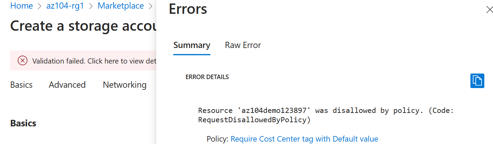

---
lab:
  title: 'Laboratório 02b: Gerenciar a governança por meio do Azure Policy'
  module: Administer Governance and Compliance
---

# Laboratório 02b - Gerenciar a Governança por meio do Azure Policy

## Introdução ao laboratório

Neste laboratório, você aprenderá a implementar os planos de governança da sua organização. Você aprenderá como as políticas do Azure podem garantir que as decisões operacionais sejam impostas em toda a organização. Você aprenderá a usar a marcação de recursos para melhorar os relatórios. 

Este laboratório requer uma assinatura do Azure. Seu tipo de assinatura pode afetar a disponibilidade de recursos neste laboratório. Você pode alterar a região, mas as etapas são escritas usando o **Leste dos EUA**. 

## Tempo estimado: 30 minutos

## Cenário do laboratório

O volume de nuvem da sua organização cresceu consideravelmente no último ano. Durante uma auditoria recente, você descobriu um número substancial de recursos que não têm um proprietário, projeto ou centro de custo definido. Para melhorar o gerenciamento de recursos do Azure em sua organização, você decide implementar a seguinte funcionalidade:

- aplicar marcas de recurso para anexar metadados importantes aos recursos do Azure

- impor o uso de marcas de recurso para novos recursos usando a política do Azure

- atualizar os recursos existentes com as marcas de recurso

- usar bloqueios de recursos para proteger os recursos configurados

## Simulações interativas de laboratório

Há várias simulações interativas do laboratório que podem ser úteis para este tópico. A simulação permite que você clique em um cenário semelhante em seu próprio ritmo. Há diferenças entre a simulação interativa e este laboratório, mas muitos dos principais conceitos são os mesmos. Uma assinatura do Azure não é necessária. 

+ [Gerenciar bloqueios de recursos](https://mslearn.cloudguides.com/en-us/guides/AZ-900%20Exam%20Guide%20-%20Azure%20Fundamentals%20Exercise%2015). Adicione um bloqueio de recurso e teste para confirmar.
  
+ [Criar uma política do Azure](https://mslearn.cloudguides.com/en-us/guides/AZ-900%20Exam%20Guide%20-%20Azure%20Fundamentals%20Exercise%2017). Crie uma política do Azure que restrinja a localização dos recursos. Crie um novo recurso e verifique se a política está imposta. 

+ [Gerenciar governança por meio da política do Azure](https://mslabs.cloudguides.com/guides/AZ-104%20Exam%20Guide%20-%20Microsoft%20Azure%20Administrator%20Exercise%203). Crie e atribua marcas por meio do portal do Azure. Crie uma política do Azure que exija marcação. Corrija os recursos sem conformidade.

## Diagrama de arquitetura

## Habilidades de trabalho

+ Tarefa 1: criar e atribuir marcas por meio do portal do Azure.
+ Tarefa 2: Impor marcação por meio de um Azure Policy.
+ Tarefa 3: Aplicar marcação por meio de um Azure Policy.
+ Tarefa 4: Configurar e testar bloqueios de recursos. 

## Tarefa 1: Atribuir marcas por meio do portal do Azure

Nesta tarefa, você criará e atribuirá uma marca a um grupo de recursos do Azure por meio do portal do Azure. As marcas são um componente crítico de uma estratégia de governança, conforme descrito pelo Microsoft Well-Architected Framework e pelo Cloud Adoption Framework. As marcas podem permitir que você identifique rapidamente proprietários de recursos, datas do pôr do sol, contatos do grupo e outros pares de nome/valor que sua organização considera importantes. Nesta tarefa, você atribuirá uma marcação que identifica o Centro de custo do recurso. 

1. Entre no **portal do Azure** - `https://portal.azure.com`.
      
1. Pesquise e selecione `Resource groups`.

1. Nos grupos de recursos, selecione **+ Criar**.

    | Configuração | Valor |
    | --- | --- |
    | Nome da assinatura | sua assinatura |
    | Nome do grupo de recursos | `az104-rg2` |
    | Localidade | **Leste dos EUA** |

    >**Observação:** Para cada laboratório neste curso, você criará um novo grupo de recursos. Isso permite que você localize e gerencie rapidamente os recursos do laboratório. 

1. Selecione **Avançar** e vá para a guia **Rótulos**. Forneça informações para um novo rótulo.

    | Configuração | Valor |
    | --- | --- |
    | Nome | Centro de Custo |
    | Valor | 000 |

1. Clique em **Examinar + Criar**, depois em **Criar**.

## Tarefa 2: Impor marcação por meio de um Azure Policy

Nesta tarefa, você atribuirá a política interna *Exigir uma marca e seu valor nos recursos* ao grupo de recursos e avaliará o resultado. O Azure Policy pode ser usado para impor a configuração e, nesse caso, a governança, aos recursos do Azure. 

1. No portal do Azure, pesquise e selecione `Policy`. 

1. Na folha **Criação**, selecione **Definições**. Reserve um momento para navegar pela lista de definições de [política internas](https://learn.microsoft.com/azure/governance/policy/samples/built-in-policies) que estão disponíveis para uso. Observe que você também pode pesquisar uma definição.

    

1. Pesquise a política integrada `Require a tag and its value on resources`. Selecione a política e reserve um minuto para examinar a definição. 

1. Selecione **Atribuir política**.

1. Especifique o **Escopo** clicando no botão de reticências e selecionando os valores a seguir. Clique em **Selecionar** quando terminar. 

    | Configuração | Valor |
    | --- | --- |
    | Subscription | *sua assinatura* |
    | Grupo de recursos | **az104-rg2** |

    >**Observação**: Você pode atribuir políticas no nível do grupo de gerenciamento, assinatura ou grupo de recursos. Você também tem a opção de especificar exclusões, como assinaturas individuais, grupos de recursos ou recursos. Nesse cenário, queremos a marca em todos os recursos do grupo de recursos.

1. Configure as propriedades **Noções básicas** da atribuição especificando as seguintes configurações (deixe as outras com os seus padrões):

    | Configuração | Valor |
    | --- | --- |
    | Nome da atribuição | Exigir rótulo do Centro de custo e seu valor em recursos |
    | Descrição | `Require Cost Center tag and its value on all resources in the resource group`|
    | Aplicação de políticas | Enabled |

    >**Observação**: O **Nome da atribuição** é preenchido automaticamente com o nome da política selecionada, mas você pode alterá-lo. A **Descrição** é opcional. Observe que você pode desabilitar a política a qualquer momento. 

1. Clique em **Avançar** e defina os **Parâmetros** como os valores a seguir:

    | Configuração | Valor |
    | --- | --- |
    | Nome da Marca | `Cost Center` |
    | Valor da marca | `000` |

1. Clique em **Avançar** e examine a guia **Correção**. Deixe a caixa de seleção **Criar uma Identidade Gerenciada** desmarcada. 

1. Clique em **Examinar + Criar** e em **Criar**.

    >**Observação**: Agora você verificará se a nova atribuição da política está em vigor ao tentar criar uma conta de Armazenamento do Microsoft Azure no grupo de recursos. Você criará a conta de armazenamento sem adicionar a marca necessária. 
    
    >**Observação**: Pode levar entre 5 e 10 minutos para que a política entre em vigor.

1. No portal, pesquise e selecione `Storage Accounts`, e selecione **+ Criar**. 

1. Na guia **Noções básicas** da folha **Criar conta de armazenamento**, conclua a configuração.

    | Configuração | Valor |
    | --- | --- |
    | Grupo de recursos | **az104-rg2** |
    | Nome da conta de armazenamento | *qualquer combinação globalmente exclusiva entre 3 e 24 letras minúsculas e dígitos, começando com uma letra* |

1. Selecione **Examinar** e clique em **Criar**.

1. Você receberá uma mensagem de **Falha na validação**. Veja a mensagem para identificar o motivo da falha. Verifique se a mensagem de erro indica que a implantação do recurso não foi permitida pela política. 

     

>**Observação**: clicando na guia **Erro Bruto**, você poderá encontrar mais detalhes sobre o erro, incluindo o nome da definição de função **Exigir um rótulo e seu valor em recursos**. A implantação falhou porque a conta de armazenamento que você tentou criar não tinha uma marca chamada **Centro de Custo** com seu valor definido como **Padrão**.

## Tarefa 3: Aplicar marca por meio de uma política do Azure

Nesta tarefa, usaremos a nova definição da política para corrigir os recursos sem conformidade. Nesse cenário, faremos com que todos os recursos filho de um grupo de recursos herdem a marca **Centro de Custo** que foi definida no grupo de recursos.

1. No portal do Azure, pesquise e selecione `Policy`. 

1. Na seção **Criação**, clique em **Atribuições**. 

1. Na lista de atribuições, clique no ícone de reticências na linha que representa a atribuição da política **Exigir rótulo do Centro de Custo e o valor Padrão em recursos** e use o item de menu **Excluir atribuição** para excluir a atribuição.

1. Clique em **Atribuir política** e especifique o **Escopo** clicando no botão de reticências e selecionando os seguintes valores:

    | Configuração | Valor |
    | --- | --- |
    | Subscription | sua assinatura do Azure |
    | Grupo de recursos | `az104-rg2` |

1. Para especificar a **Definição da política**, clique no botão de reticências e pesquise e selecione `Inherit a tag from the resource group if missing`.

1. Selecione **Adicionar** e configure as propriedades **Noções básicas** restantes da atribuição.

    | Configuração | Valor |
    | --- | --- |
    | Nome da atribuição | `Inherit the Cost Center tag and its value 000 from the resource group if missing` |
    | Descrição | `Inherit the Cost Center tag and its value 000 from the resource group if missing` |
    | Aplicação de políticas | Enabled |

1. Clique em **Avançar** duas vezes e defina os **Parâmetros** como os valores a seguir:

    | Configuração | Valor |
    | --- | --- |
    | Nome da Marca | `Cost Center` |

1. Clique em **Avançar** e, na guia **Correção**, defina as seguintes configurações (deixe as outras com os seus padrões):

    | Configuração | Valor |
    | --- | --- |
    | Criar uma tarefa de correção | Habilitado |
    | Política a ser corrigida | **Herdar uma marca do grupo de recursos, se ela estiver ausente** |

    >**Observação**: Esta definição de política inclui o efeito **Modificar**. Portanto, uma identidade gerenciada é necessária. 

     

1. Clique em **Examinar + Criar** e em **Criar**.

    >**Observação**: Para verificar se a nova atribuição da política está em vigor, você criará outra conta de armazenamento do Azure no mesmo grupo de recursos sem adicionar explicitamente a marca necessária. 
    
    >**Observação**: Pode levar entre 5 e 10 minutos para que a política entre em vigor.

1. Pesquise e selecione `Storage Account` e clique em **+ Criar**. 

1. Na guia **Noções básicas** da folha **Criar conta de armazenamento**, verifique se você está usando o Grupo de Recursos ao qual a Política foi aplicada e especifique as seguintes configurações (deixe as outras com os seus padrões) e clique em **Examinar**:

    | Configuração | Valor |
    | --- | --- |
    | Nome da conta de armazenamento | *qualquer combinação globalmente exclusiva entre 3 e 24 letras minúsculas e dígitos, começando com uma letra* |

1. Verifique se, desta vez, a validação passou e clique em **Criar**.

1. Depois que a nova conta de armazenamento for provisionada, clique em **Ir para o recurso**.

1. Na folha **Marcas**, observe que a marca **Centro de Custo** com o valor **000** foi atribuída automaticamente ao recurso.

    >**Você sabia?** Se você pesquisar e selecionar **Marcas** no portal, poderá exibir os recursos com uma marca específica. 

## Tarefa 4: Configurar e testar bloqueios de recursos

Nesta tarefa, você configura e testa um bloqueio de recurso. Os bloqueios impedem exclusões ou modificações de um recurso. 

1. Pesquise e selecione seu grupo de recursos.
   
1. Na folha **Configurações**, selecione **Bloqueios**.

1. Selecione **Adicionar** e conclua as informações de bloqueio de recursos. Quando terminar, selecione **Ok**. 

    | Configuração | Valor |
    | --- | --- |
    | Nome do bloqueio | `rg-lock` |
    | Tipo de bloqueio | **excluir** (observe a seleção somente leitura) |
    
1. Navegue até a folha **Visão geral** do grupo de recursos e selecione **Excluir grupo de recursos**.

1. Na caixa de texto **Inserir o nome do grupo de recursos para confirmar a exclusão**, forneça o nome do grupo de recursos, `az104-rg2`. Observe que você pode copiar e colar o nome do grupo de recursos. 

1. Observe o aviso: A exclusão deste grupo de recursos e seus recursos dependentes é uma ação permanente e não pode ser desfeita. Selecione **Excluir**.

1. Você deve receber uma notificação negando a exclusão. 

     

    >**Observação:** Você precisará remover o bloqueio se pretende excluir o grupo de recursos. 
    
## Limpar os recursos

Se você estiver trabalhando com **sua própria assinatura**, reserve um minuto para excluir os recursos do laboratório. Isso garantirá que os recursos sejam liberados e que o custo seja minimizado. A maneira mais fácil de excluir os recursos do laboratório é excluir o grupo de recursos do laboratório. 

+ No portal do Azure, selecione o grupo de recursos, selecione **Excluir o grupo de recursos**, **Inserir o nome do grupo de recursos** e clique em **Excluir**.
+ Usar o Azure PowerShell, `Remove-AzResourceGroup -Name resourceGroupName`.
+ Usar a CLI, `az group delete --name resourceGroupName`.

## Estender seu aprendizado com o Copilot
O Copilot pode ajudar você a aprender a usar as ferramentas de script do Azure. O Copilot também pode ajudar em áreas não cobertas no laboratório ou onde você precisar de mais informações. Abra um navegador do Edge e escolha Copilot (canto superior direito) ou navegue até *copilot.microsoft.com*. Reserve alguns minutos para experimentar essas solicitações.
+ Quais são os comandos do Azure PowerShell e da CLI para adicionar e excluir bloqueios de recursos em um grupo de recursos?
+ Tabule as diferenças entre a política do Azure e o RBAC do Azure, incluindo exemplos.
+ Quais são as etapas para impor a política do Azure e corrigir recursos que não estão em conformidade?
+ Como posso obter um relatório de recursos do Azure com marcas específicas?

## Saiba mais com treinamento individual

+ [Criar uma estratégia de governança corporativa](https://learn.microsoft.com/training/modules/enterprise-governance/). Use o RBAC e o Azure Policy para limitar o acesso às soluções do Azure e determinar qual é o método certo para suas metas de segurança.

## Principais aspectos a serem lembrados

Parabéns por concluir o laboratório. Aqui estão as principais lições deste laboratório. 

+ As marcas do Azure são metadados que consistem em um par chave-valor. As marcas descrevem um recurso específico em seu ambiente. Em particular, a marcação no Azure permite que você rotule seus recursos de uma forma lógica.
+ O Azure Policy estabelece convenções para recursos. As definições de política descrevem as condições de conformidade do recurso e o efeito a ser tomada se uma condição for atendida. Uma condição compara um field ou um value da propriedade de recurso com um valor obrigatório. Há muitas definições de políticas internas e você pode personalizar as políticas. 
+ O recurso de tarefa de correção do Azure Policy é usado para colocar recursos em conformidade com base em uma definição e atribuição. Os recursos sem conformidade com uma atribuição de definição modify ou deployIfNotExist podem ser colocados em conformidade usando uma tarefa de correção.
+ Você pode configurar um bloqueio de recurso em uma assinatura, grupo de recursos ou recurso. O bloqueio pode proteger um recurso contra exclusões e modificações acidentais do usuário. O bloqueio substitui todas as permissões que o usuário tenha.
+ O Azure Policy é uma prática de segurança de pré-implantação. O RBAC e os bloqueios de recursos são práticas de segurança pós-implantação.

