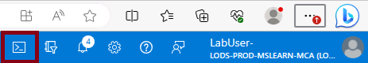

---
lab:
  title: 'Laboratório 03: Gerenciar recursos do Azure usando Modelos do Azure Resource Manager'
  module: Administer Azure Resources
---

# Laboratório 03 – Gerenciar recursos do Azure usando Modelos do Azure Resource Manager

## Introdução ao laboratório

Neste laboratório, você aprenderá a automatizar implantações de recursos. Você aprenderá sobre modelos do Azure Resource Manager e modelos do Bicep. Você aprenderá sobre as diferentes maneiras de implantar os modelos. 

Este laboratório requer uma assinatura do Azure. Seu tipo de assinatura pode afetar a disponibilidade de recursos neste laboratório. Você pode alterar a região, mas as etapas são escritas usando o **Leste dos EUA**. 

## Tempo estimado: 50 minutos

## Simulações interativas de laboratório

Há simulações interativas do laboratório que podem ser úteis para este tópico. A simulação permite que você clique em um cenário semelhante em seu próprio ritmo. Há diferenças entre a simulação interativa e este laboratório, mas muitos dos principais conceitos são os mesmos. Uma assinatura do Azure não é necessária. 

+ [Gerenciar recursos do Azure usando modelos do Azure Resource Manager](https://mslabs.cloudguides.com/guides/AZ-104%20Exam%20Guide%20-%20Microsoft%20Azure%20Administrator%20Exercise%205). Examine, crie e implante um disco gerenciado com um modelo.
  
+ [Criar uma máquina virtual com um modelo](https://mslearn.cloudguides.com/en-us/guides/AZ-900%20Exam%20Guide%20-%20Azure%20Fundamentals%20Exercise%209). Implantar uma máquina virtual com um modelo de início rápido.
  
## Cenário do laboratório

Sua equipe deseja procurar maneiras de automatizar e simplificar as implantações de recursos. Sua organização está procurando maneiras de reduzir a sobrecarga administrativa, reduzir o erro humano e aumentar a consistência.  

## Diagrama de arquitetura


## Habilidades de trabalho

+ Tarefa 1: criar um modelo do Azure Resource Manager.
+ Tarefa 2: editar um modelo do Azure Resource Manager e reimplantá-lo.
+ Tarefa 3: configurar o Cloud Shell e implantar um modelo com o Azure PowerShell.
+ Tarefa 4: implantar um modelo com o CLI. 
+ Tarefa 5: Implantar um recurso usando o Azure Bicep.

## Tarefa 1: Criar um modelo do Azure Resource Manager

Nesta tarefa, criaremos um disco gerenciado no portal do Azure. Os discos gerenciados são armazenamento projetados para serem usados com as máquinas virtuais. Depois que o disco for implantado, você exportará um modelo que poderá ser usado em outras implantações.

1. Entre no **portal do Azure** - `https://portal.azure.com`.

1. Pesquise e selecione `Disks`. 
   
1. Na página Discos, selecione **Criar**.

1. Na página **Criar um disco gerenciado**, configure o disco e selecione **Ok**. 
    
    | Configuração | Valor |
    | --- | --- |
    | Subscription | *sua assinatura* | 
    | Grupo de recursos | `az104-rg3` (Se necessário, selecione **Criar novo**.)
    | Nome do disco | `az104-disk1` | 
    | Region | **Leste dos EUA** |
    | Zona de disponibilidade | **Nenhuma redundância de infraestrutura necessária** | 
    | Tipo de origem | **Nenhuma** |
    | Desempenho | **HDD Standard** (alterar tamanho) |
    | Tamanho | **32 Gib** | 

    >**Observação:** Estamos criando um disco gerenciado simples para que você possa praticar com os modelos. Os discos gerenciados do Azure são volumes de armazenamento em nível de bloco gerenciados pelo Azure.

1. Clique em **Examinar + Criar** e selecione **Criar**.

1. Monitore as notificações (canto superior direito) e, após a implantação, selecione **Ir para o recurso**. 

1. Na folha **Automação**, selecione **Exportar modelo**. 

1. Reserve um minuto para examinar os arquivos **Modelo** e **Parâmetros**.

1. Clique em **Baixar** e salve os modelos na unidade local. Isso cria um arquivo zip compactado. 

1. Use o Explorador de Arquivos para extrair o conteúdo do arquivo baixado na pasta **Downloads** em seu computador. Observe que há dois arquivos JSON (modelo e parâmetros). 

   >**Você sabia?**  Você pode exportar um grupo de recursos inteiro ou apenas recursos específicos dentro desse grupo de recursos.

## Tarefa 2: Editar um modelo do Azure Resource Manager e, em seguida, reimplante o modelo

Nesta tarefa, você usa o modelo baixado para implantar um novo disco gerenciado. Essa tarefa descreve como repetir implantações com rapidez e facilidade. 

1. No portal do Azure, pesquise e selecione `Deploy a custom template`.

1. Na folha **Implantação personalizada**, observe que há a capacidade de usar um **Modelo de início rápido**. Há muitos modelos internos, conforme mostrado no menu suspenso. 

1. Em vez de usar um início rápido, selecione **Criar seu próprio modelo no editor**.

1. Na folha **Editar modelo**, clique em **Carregar arquivo** e carregue o arquivo **template.json** que você baixou no disco local.

1. No painel do editor, faça estas alterações.

    + Altere **disks_az104_disk1_name** para `disk_name` (dois lugares para alterar)
    + Altere **az104_disk1** para `az104-disk2` (um lugar para alteração)

1. Observe que este é um disco **Standard**. O local é **eastus**. O tamanho do disco é de **32 GB**.

1. **Salve** suas alterações.

1. Não se esqueça do arquivo de parâmetros. Selecione **Editar parâmetros**, clique em **Carregar arquivo** e carregue o **parameters.json**. 

1. Faça esta alteração para que corresponda ao arquivo de modelo.

    Altere **disks_az104_disk1_name** para **disk_name** (um lugar para alterar)

1. **Salve** suas alterações. 

1. Conclua as configurações de implantação personalizadas:

    | Configuração | Valor |
    | --- |--- |
    | Subscription | *sua assinatura* |
    | Grupo de recursos | `az104-rg3` |
    | Região | **(EUA) Leste dos EUA** |
    | Disk_name | `az104-disk2` |

1. Selecione **Examinar + Criar** e **Criar**.

1. Selecione **Ir para o recurso**. Verifique se **o az104-disk2** foi criado.

1. Na folha **Visão geral**, selecione o grupo de recursos, **az104-rg3**. Agora você deve ter dois discos.
   
1. Na seção **Configurações**, clique em **Implantações**.

    >**Observação:** Todos os detalhes das implantações estão documentados no grupo de recursos. É uma boa prática examinar as primeiras implantações baseadas em modelo para garantir o sucesso antes de usar os modelos para operações em grande escala.

1. Selecione uma implantação e examine o conteúdo das folhas **Entrada** e **Modelo**.

## Tarefa 3: Configurar o Cloud Shell e implantar um modelo com o PowerShell 

Nesta tarefa, você trabalha com o Azure Cloud Shell e o Azure PowerShell. O Azure Cloud Shell é um terminal interativo, autenticado e acessível pelo navegador para o gerenciamento de recursos do Azure. Ele dá a você a flexibilidade de escolher a experiência de shell que melhor se adequa ao modo como você trabalha, seja com o Bash ou o PowerShell. Nesta tarefa, você usa o PowerShell para implantar um modelo. 

1. Selecione o ícone **Cloud Shell** no canto superior direito do portal do Azure. Como alternativa, você pode navegar diretamente para `https://shell.azure.com`.

   

1. Quando solicitado a selecionar **Bash** ou **PowerShell**, selecione **PowerShell**. 

    >**Você sabia?**  Se você trabalha principalmente com sistemas Linux, o Bash (CLI) será mais familiar. Se você trabalha principalmente com sistemas Windows, o Azure PowerShell será mais familiar. 

1. Na tela **Introdução**, selecione **Montar conta de armazenamento**, selecione a sua **Assinatura de conta de armazenamento** e selecione **Aplicar**.

1. Selecione **Quero criar uma conta de armazenamento** e, em seguida, **Avançar**. Complete as informações em **Criar conta de armazenamento**. 
    
    | Configurações | Valores |
    |  -- | -- |
    | Grupo de recursos | **az104-rg3** |
    | Region | *selecione sua região* | 
    | Conta de armazenamento (Criar nova) | *deve ser globalmente exclusivo, ter entre 3 e 24 caracteres e usar apenas números e letras minúsculas* |
    | Compartilhamento de arquivo (Criar novo) | `fs-cloudshell` |

1. Quando concluído, selecione **Criar**.

    >Levará alguns minutos para provisionar o armazenamento.

1. Selecione **Configurações** (barra superior) e **Ir para a versão clássica**.

1. Selecione o ícone **Carregar/Baixar arquivos** (barra superior) e selecione **Carregar**.

1. Carregue os arquivos de modelo e parâmetros do diretório **Downloads**. 

1. Selecione o ícone **Editor (chaves)** e navegue até o arquivo JSON de modelo à esquerda no painel de navegação.

1. Faça uma alteração. Por exemplo, altere o nome do disco para **az104-disk3**. Use **Ctrl +S** para salvar suas alterações. 

    >**Observação**: Você pode direcionar sua implantação de modelo para um grupo de recursos, assinatura, grupo de gerenciamento ou locatário. Dependendo do escopo da implantação, você usará comandos diferentes.

1. Para implantar em um grupo de recursos, use **New-AzResourceGroupDeployment**.

    ```powershell
    New-AzResourceGroupDeployment -ResourceGroupName az104-rg3 -TemplateFile template.json -TemplateParameterFile parameters.json
    ```
1. Verifique se o comando foi concluído e se o ProvisioningState foi **Bem-sucedido**.

1. Confirme se o disco foi criado.

   ```powershell
   Get-AzDisk
   ```
   
## Tarefa 4: Implantar um modelo com a CLI 

1. Continue no **Cloud Shell**, selecione **Bash**. **Confirme** sua escolha.

1. Verifique se os arquivos estão disponíveis no armazenamento do Cloud Shell. Se você concluiu a tarefa anterior, os arquivos de modelo devem estar disponíveis. 

    ```sh
    ls
    ```

1. Selecione o ícone do **Editor** (colchetes) e navegue até o arquivo JSON do modelo.

1. Faça uma alteração. Por exemplo, altere o nome do disco para **az104-disk4**. Use **Ctrl +S** para salvar suas alterações. 

    >**Observação**: Você pode direcionar sua implantação de modelo para um grupo de recursos, assinatura, grupo de gerenciamento ou locatário. Dependendo do escopo da implantação, você usará comandos diferentes.

1. Para implantar em um grupo de recursos, use **az deployment group create**.

    ```sh
    az deployment group create --resource-group az104-rg3 --template-file template.json --parameters parameters.json
    ```
    
1. Verifique se o comando foi concluído e se o ProvisioningState foi **Bem-sucedido**.

1. Confirme se o disco foi criado.

     ```sh
     az disk list --output table
     ```
   
## Tarefa 5: Implantar um recurso usando o Azure Bicep

Nesta tarefa, você usará um arquivo do Bicep para implantar um disco gerenciado. O Bicep é uma ferramenta de automação declarativa criada em modelos do ARM.

1. Localize o arquivo **\Allfiles\Lab03\azuredeploydisk.bicep** file.

1. Continue trabalhando no **Cloud Shell** em uma sessão do **Bash**.

1. Selecione **Gerenciar arquivos** e, em seguida, **Carregue** o arquivo Bicep no Cloud Shell. 

1. Clique em **Editor** e, quando solicitado, em **Confirmar** a mudança para o Cloud Shell Clássico.

1. Selecione o arquivo **azuredeploydisk.bicep** 

1. Reserve um minuto para ler o arquivo de modelo do Bicep. Observe como o recurso do disco é definido. 
   
1. Faça as seguintes alterações:

    + Altere o valor **managedDiskName**, linha 2, para Disk4.
    + Altere o valor do **nome da SKU**, linha 26, para StandardSSD_LRS.
    + Altere o valor **diskSizeinGiB**, linha 7, para 32.

    >**Observação:** um modelo Bicep completo está disponível nos arquivos de laboratório.
    
1. Use **Ctrl +S** para salvar suas alterações.

1. Agora, implante o modelo.

    ```
    az deployment group create --resource-group az104-rg3 --template-file azuredeploydisk.bicep
    ```

1. Confirme se o disco foi criado.

    ```sh
    az disk list --output table
    ```

    >**Observação:** Você implantou com sucesso cinco discos gerenciados, cada um de uma maneira diferente. Bom trabalho!

## Limpar os recursos

Se você estiver trabalhando com **sua própria assinatura**, reserve um minuto para excluir os recursos do laboratório. Isso garantirá que os recursos sejam liberados e que o custo seja minimizado. A maneira mais fácil de excluir os recursos do laboratório é excluir o grupo de recursos do laboratório. 

+ No portal do Azure, selecione o grupo de recursos, selecione **Excluir o grupo de recursos**, **Inserir o nome do grupo de recursos** e clique em **Excluir**.
+ Usar o Azure PowerShell, `Remove-AzResourceGroup -Name resourceGroupName`.
+ Usar a CLI, `az group delete --name resourceGroupName`.

## Estender seu aprendizado com o Copilot

O Copilot pode ajudar você a aprender a usar as ferramentas de script do Azure. O Copilot também pode ajudar em áreas não cobertas no laboratório ou onde você precisar de mais informações. Abra um navegador do Edge e escolha Copilot (canto superior direito) ou navegue até *copilot.microsoft.com*. Reserve alguns minutos para experimentar essas solicitações.

+ Qual é o formato do arquivo de modelo do Azure Resource Manager? Explicar cada componente com exemplos. 
+ Como posso usar um modelo existente do Azure Resource Manager?
+ Compare e contraste modelos do Azure Resource Manager e modelos do Azure Bicep. 


## Saiba mais com treinamento individual

+ [Implantar a infraestrutura do Azure usando modelos do ARM JSON](https://learn.microsoft.com/training/modules/create-azure-resource-manager-template-vs-code/). Grave modelos JSON do ARM (modelos do Azure Resource Manager) usando o Visual Studio Code para implantar sua infraestrutura no Azure de modo consistente e confiável.
+ [Examinar os recursos e as ferramentas do Azure Cloud Shell](https://learn.microsoft.com/training/modules/review-features-tools-for-azure-cloud-shell/). Recursos e ferramentas do Cloud Shell. 
+ [Gerenciar recursos do Azure com o Windows PowerShell](https://learn.microsoft.com/training/modules/manage-azure-resources-windows-powershell/). Este módulo explica como instalar os módulos necessários para o gerenciamento de serviços de nuvem e usar os comandos do PowerShell para executar tarefas administrativas simples em recursos de nuvem, como máquinas virtuais do Azure, assinaturas do Azure e contas de armazenamento do Azure.
+ [Introdução a Bash](https://learn.microsoft.com/training/modules/bash-introduction/). Use o Bash para gerenciar a infraestrutura de TI.
+ [Crie seu primeiro modelo do Bicep](https://learn.microsoft.com/training/modules/build-first-bicep-template/). Defina os recursos do Azure em um modelo Bicep. Melhore a consistência e a confiabilidade de suas implantações, reduza o esforço manual necessário e dimensione suas implantações entre ambientes. Ao usar parâmetros, variáveis, expressões e módulos, seu modelo será flexível e reutilizável.

## Principais aspectos a serem lembrados

Parabéns por concluir o laboratório. Aqui estão as principais lições deste laboratório. 

+ Os modelos do Azure Resource Manager permitem implantar, gerenciar e monitorar todos os recursos da solução como um grupo, em vez de lidar com esses recursos individualmente.
+ Um modelo do Azure Resource Manager é um arquivo JSON (JavaScript Object Notation) que permite gerenciar sua infraestrutura declarativamente e não com scripts.
+ Em vez de passar parâmetros como valores embutidos em seu modelo, você pode usar um arquivo JSON separado que contém os valores do parâmetro.
+ Os modelos do Azure Resource Manager podem ser implantados de várias maneiras, incluindo o portal do Azure, o Azure PowerShell e a CLI.
+ O Bicep é uma alternativa aos modelos do Azure Resource Manager. O Bicep usa uma sintaxe declarativa para implantar os recursos do Azure.
+ O Bicep fornece sintaxe concisa, segurança de tipos confiável e suporte para reutilização de código. O Bicep uma experiência de criação de alto nível para suas soluções de infraestrutura como código no Azure.


