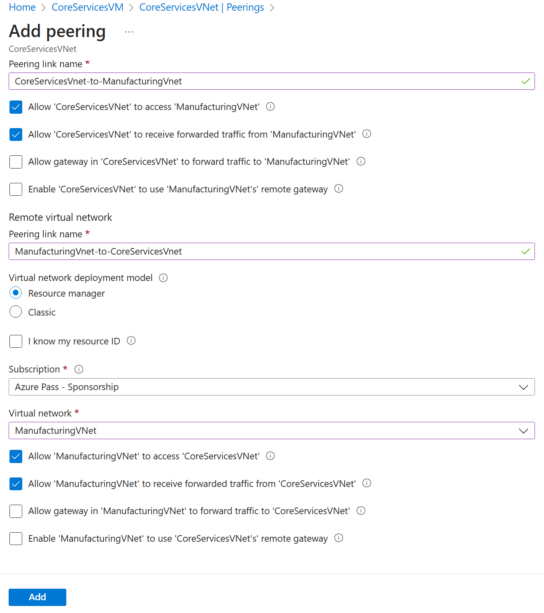

---
lab:
  title: "Laboratório\_05: Implementar a conectividade entre sites"
  module: Administer Intersite Connectivity
---

# Laboratório 05 - implementar conectividade entre sites

## Introdução ao laboratório

Neste laboratório, você explora a comunicação entre redes virtuais. Você implementa o emparelhamento de rede virtual e testa as conexões. Você também criará uma rota personalizada. 

Este laboratório requer uma assinatura do Azure. Seu tipo de assinatura pode afetar a disponibilidade de recursos neste laboratório. Você pode alterar a região, mas as etapas são escritas usando o **Leste dos EUA**. 

## Tempo estimado: 50 minutos
    
## Cenário do laboratório 

Sua organização segmenta os principais aplicativos e serviços de TI (como DNS e serviços de segurança) de outras partes do negócio, incluindo seu departamento de fabricação. No entanto, em alguns cenários, os aplicativos e serviços na área principal precisam se comunicar com os aplicativos e serviços na área de fabricação. Neste laboratório, você configura a conectividade entre as áreas segmentadas. Este é um cenário comum para separar a produção do desenvolvimento ou separar uma subsidiária da outra.  

## Simulações interativas do laboratório

Há várias simulações interativas do laboratório que podem ser úteis para este tópico. A simulação permite que você clique em um cenário semelhante em seu próprio ritmo. Há diferenças entre a simulação interativa e este laboratório, mas muitos dos principais conceitos são os mesmos. Não é necessária uma assinatura do Azure. 

+ [Conectar duas redes virtuais do Azure usando o emparelhamento de rede virtual global](https://mslabs.cloudguides.com/guides/AZ-700%20Lab%20Simulation%20-%20Connect%20two%20Azure%20virtual%20networks%20using%20global%20virtual%20network%20peering). Teste a conexão entre duas máquinas virtuais em redes virtuais diferentes. Crie um emparelhamento de rede virtual e retome.

+ [Configurar o monitoramento para redes virtuais](https://learn.microsoft.com/training/modules/configure-monitoring-virtual-networks/). Entenda como usar o Monitor de Conexão do Observador de Rede do Azure, os logs de fluxo, os diagnósticos de NSG e a captura de pacotes para monitorar a conectividade entre os recursos de rede da sua IaaS do Azure.

+ [Implementar a conectividade entre sites](https://mslabs.cloudguides.com/en-us/guides/AZ-104%20Exam%20Guide%20-%20Microsoft%20Azure%20Administrator%20Exercise%209). Execute um modelo para criar uma infraestrutura de rede virtual com várias máquinas virtuais. Configure o emparelhamentos de rede virtual e teste as conexões. 

## Diagrama de arquitetura


## Habilidades de trabalho

+ Tarefa 1: Criar uma máquina virtual em uma rede virtual.
+ Tarefa 2: Criar uma máquina virtual em uma rede virtual diferente.
+ Tarefa 3: Usar o Observador de Rede para testar a conexão entre máquinas virtuais. 
+ Tarefa 4: Configurar o emparelhamentos de rede virtual entre diferentes redes virtuais.
+ Tarefa 5: Usar o Azure PowerShell para testar a conexão entre máquinas virtuais.
+ Tarefa 6:criar uma rota personalizada. 

## Tarefa 1:  Criar uma máquina virtual de serviços principais e uma rede virtual

Nesta tarefa, você cria uma rede virtual de serviços principais com uma máquina virtual. 

1. Entre no **portal do Azure** - `https://portal.azure.com`.

1. Pesquise e selecione `Virtual Machines`.

1. Na página Máquinas virtuais, selecione **Criar** e selecione **Máquina Virtual do Azure**.

1. Na guia Noções básicas, use as informações a seguir para concluir o formulário e selecione **Avançar: Discos >**. Para qualquer configuração não especificada, deixe o valor padrão.
 
    | Configuração | Valor | 
    | --- | --- |
    | Subscription |  *sua assinatura* |
    | Grupo de recursos |  `az104-rg5` (se necessário, **Criar novo**. )
    | Nome da máquina virtual |    `CoreServicesVM` |
    | Região | **(EUA) Leste dos EUA** |
    | Opções de disponibilidade | Nenhuma redundância de infraestrutura necessária |
    | Tipo de segurança | **Standard** |
    | Imagem | **Windows Server 2019 Datacenter: x64 Gen2** (observe suas outras opções) |
    | Tamanho | **Standard_DS2_v3** |
    | Nome de usuário | `localadmin` | 
    | Senha | **Fornecer uma senha complexa** |
    | Porta de entrada públicas | **Nenhuma** |

    
   
1. Na guia **Discos**, siga os padrões e selecione **Avançar: Rede >**.

1. Na guia **Rede**, para rede virtual, selecione **Criar nova**.

1. Use as informações a seguir para configurar a rede virtual e selecione **Ok**. Se necessário, remova ou substitua as informações existentes.

    | Configuração | Valor | 
    | --- | --- |
    | Nome | `CoreServicesVnet` (Criar novo) |
    | Intervalo de endereços | `10.0.0.0/16`  |
    | Nome da sub-rede | `Core` | 
    | Intervalo de endereços da sub-rede | `10.0.0.0/24` |

1. Selecione a guia **Monitoramento**. Para Diagnóstico de inicialização, selecione **Desabilitar**.

1. Clique em **Examinar + Criar**, depois em **Criar**.

1. Você não precisa aguardar a criação dos recursos. Continue para a próxima tarefa.

    >**Observação:** Você percebeu nesta tarefa que criou a rede virtual da mesma forma que criou a máquina virtual? Você também pode criar a infraestrutura de rede virtual e, em seguida, adicionar as máquinas virtuais. 

## Tarefa 2: Criar uma máquina virtual em uma rede virtual diferente

Nesta tarefa, você cria uma rede virtual de serviços de fabricação com uma máquina virtual. 

1. No portal do Azure, pesquise e navegue até **Máquinas virtuais**.

1. Na página Máquinas virtuais, selecione **Criar** e selecione **Máquina Virtual do Azure**.

1. Na guia Noções básicas, use as informações a seguir para concluir o formulário e selecione **Avançar: Discos >**. Para qualquer configuração não especificada, deixe o valor padrão.
 
    | Configuração | Valor | 
    | --- | --- |
    | Subscription |  *sua assinatura* |
    | Grupo de recursos |  `az104-rg5` |
    | Nome da máquina virtual |    `ManufacturingVM` |
    | Região | **(EUA) Leste dos EUA** |
    | Tipo de segurança | **Standard** |
    | Opções de disponibilidade | Nenhuma redundância de infraestrutura necessária |
    | Imagem | **Windows Server 2019 Datacenter: x64 Gen2** |
    | Tamanho | **Standard_DS2_v3** | 
    | Nome de usuário | `localadmin` | 
    | Senha | **Fornecer uma senha complexa** |
    | Porta de entrada públicas | **Nenhuma** |

1. Na guia **Discos**, siga os padrões e selecione **Avançar: Rede >**.

1. Na guia Rede, para rede virtual, selecione **Criar nova**.

1. Use as informações a seguir para configurar a rede virtual e selecione **Ok**.  Se necessário, remova ou substitua o intervalo de endereços existente.

    | Configuração | Valor | 
    | --- | --- |
    | Nome | `ManufacturingVnet` |
    | Intervalo de endereços | `172.16.0.0/16`  |
    | Nome da sub-rede | `Manufacturing` |
    | Intervalo de endereços da sub-rede | `172.16.0.0/24` |

1. Selecione a guia **Monitoramento**. Para Diagnóstico de inicialização, selecione **Desabilitar**.

1. Clique em **Examinar + Criar**, depois em **Criar**.

## Tarefa 3: Use o Observador de Rede para testar a conexão entre as máquinas virtuais 


Nesta tarefa, você verifica se os recursos em redes virtuais emparelhadas podem se comunicar entre si. O Observador de Rede será usado para testar a conexão. Antes de continuar, verifique se ambas as máquinas virtuais foram implantadas e estão em execução. 

1. No portal do Azure, pesquise e selecione `Network Watcher`.

1. No Observador de Rede, no menu Ferramentas de Diagnóstico de Rede, selecione **Solucionar problemas de conexão**.

1. Use as informações a seguir para concluir os campos na página **Solução de problemas de conexão**.

    | Campo | Valor | 
    | --- | --- |
    | Tipo de origem           | **Máquina virtual**   |
    | Máquina virtual       | **CoreServicesVM**    | 
    | Tipo de destino      | **Máquina virtual**   |
    | Máquina virtual       | **ManufacturingVM**   | 
    | Versão de IP preferencial  | **Ambas**              | 
    | Protocolo              | **TCP**               |
    | Porta de destino      | `3389`                |  
    | Porta de origem           | *Em branco*:         |
    | Testes de diagnóstico      | *Defaults*      |

    

1. Selecione **Executar testes de diagnóstico**.

    >**Observação**: Pode levar alguns minutos para que os resultados sejam retornados. As seleções de tela ficarão acinzentadas enquanto os resultados estiverem sendo coletados. Observe que o **Teste de conectividade** mostra **UnReachable**. Isso faz sentido porque as máquinas virtuais estão em redes virtuais diferentes. 

 
## Tarefa 4: Configurar os emparelhamentos de rede virtual entre as redes virtuais

Nesta tarefa, você cria um emparelhamento de rede virtual para habilitar a comunicação entre recursos nas redes virtuais. 

1. No portal do Azure, selecione a rede virtual `CoreServicesVnet`.

1. Em CoreServicesVnet, em **Configurações**, escolha **Emparelhamentos**.

1. Em CoreServicesVnet | Emparelhamentos, escolha **+ Adicionar**.

1. Use as informações da tabela abaixo para criar o emparelhamento.

| **Parâmetro**                                    | **Valor**                             |
| --------------------------------------------- | ------------------------------------- |
| **Esta rede virtual**                                       |                                       |
| Nome do link de emparelhamento                             | `CoreServicesVnet-to-ManufacturingVnet` |
| Permitir que CoreServicesVnet acesse a rede virtual emparelhada            | selecionado (padrão)                       |
| Permitir que CoreServicesVnet receba tráfego encaminhado da rede virtual emparelhada | selecionado                       |
| Permitir que o gateway no CoreServicesVnet encaminhe o tráfego para a rede virtual emparelhada | Não selecionado (padrão) |
| Habilitar CoreServicesVnt para usar o gateway remoto das redes virtuais emparelhadas       | Não selecionado (padrão)                        |
| **Rede virtual remota**                                   |                                       |
| Nome do link de emparelhamento                             | `ManufacturingVnet-to-CoreServicesVnet` |
| Modelo de implantação de rede virtual              | **Gerenciador de recursos**                      |
| Conheço minha ID do recurso                         | Não selecionado                          |
| Assinatura                                  | *sua assinatura*    |
| Rede virtual                               | **ManufacturingVnet**                     |
| Permitir que ManufacturingVnet acesse CoreServicesVnet  | selecionado (padrão)                       |
| Permitir que ManufacturingVnet receba tráfego encaminhado do CoreServicesVnet | selecionado                        |
| Permitir que o gateway no CoreServicesVnet encaminhe o tráfego para a rede virtual emparelhada | Não selecionado (padrão) |
| Habilitar ManufacturingVnet para usar o gateway remoto do CoreServicesVnet       | Não selecionado (padrão)                        |

1. Examine suas configurações e selecione **Adicionar**.



 
1. Em CoreServicesVnet | Emparelhamentos, verifique se o emparelhamento **CoreServicesVnet-to-ManufacturingVnet** está listado. Atualize a página para garantir que o **Status de emparelhamento** esteja **Conectado**.

1. Alterne para o **ManufacturingVnet** e verifique se o emparelhamento **ManufacturingVnet-to-CoreServicesVnet** está listado. Verifique se o de **Status de emparelhamento** esteja **Conectado**. Talvez seja necessário **Atualizar** a página. 


## Tarefa 5: Usar o Azure PowerShell para testar a conexão entre as máquinas virtuais

Nesta tarefa, você testará novamente a conexão entre as máquinas virtuais em diferentes redes virtuais. 

### Verificar o endereço IP privado do CoreServicesVM

1. No portal do Azure, pesquise e selecione a máquina virtual `CoreServicesVM`.

1. Na folha **Visão geral**, na seção **Sistema de rede**, registre o **Endereço IP privado** do computador. Você precisa dessas informações para testar a conexão.
   
### Teste a conexão com o CoreServicesVM do **ManufacturingVM**.

>**Você sabia?** Há muitas maneiras de verificar as conexões. Nesta tarefa, você usa o **Executar comando**. Você também pode continuar a usar o Observador de Rede. Ou você pode usar uma [Conexão de Área de Trabalho Remota](https://learn.microsoft.com/azure/virtual-machines/windows/connect-rdp#connect-to-the-virtual-machine) para acessar a máquina virtual. Depois de conectado, use **test-connection**. Se você tiver tempo, experimente o RDP. 

1. Alterne para a máquina virtual `ManufacturingVM`.

1. Na folha **Operações**, selecione a folha **Executar comando**.

1. Selecione **RunPowerShellScript** e execute o comando **Test-NetConnection**. Certifique-se de usar o endereço IP privado do **CoreServicesVM**.

    ```Powershell
    Test-NetConnection <CoreServicesVM private IP address> -port 3389
    ```
1. Pode levar alguns minutos para o script atingir o tempo limite. A parte superior da página mostra uma mensagem informativa *Execução de script em andamento*.

   
1. A conexão de teste deve ser bem-sucedida porque o emparelhamento foi configurado. O nome do computador e o endereço remoto neste gráfico podem ser diferentes. 
   
   

## Tarefa 6: Criar uma rota personalizada 

Nesta tarefa, você deseja controlar o tráfego de rede entre a sub-rede de perímetro e a sub-rede de serviços principais internas. Um dispositivo de rede virtual será instalado na sub-rede de serviços principais e todo o tráfego deverá ser roteado para lá. 

1. Pesquise e selecione o `CoreServicesVnet`.

1. Selecione **Sub-redes** e, em seguida, **+ Criar**. Não se esqueça de **Salvar** suas alterações. 

    | Configuração | Valor | 
    | --- | --- |
    | Nome | `perimeter` |
    | Intervalo de endereços da sub-rede | `10.0.1.0/24`  |

   
1. No portal do Azure, pesquise e selecione `Route tables` e, em seguida, selecione **Criar**. 

    | Configuração | Valor | 
    | --- | --- |
    | Subscription | sua assinatura |
    | Grupo de recursos | `az104-rg5`  |
    | Região | **Leste dos EUA** |
    | Nome | `rt-CoreServices` |
    | Propagar rotas de gateway | **Não** |

1. Depois que a tabela de rotas for implantada, selecione **Ir para o recurso**.

1. Selecione **Rotas** e, em seguida, **+ Adicionar**. Crie uma rota do futuro NVA para a rede virtual CoreServices. 

    | Configuração | Valor | 
    | --- | --- |
    | Nome da rota | `PerimetertoCore` |
    | Tipo de destino | **Endereços IP** |
    | Endereços IP de destino | `10.0.0.0/16` (rede virtual de serviços principais) |
    | Tipo do próximo salto | **Solução de virtualização** (observe suas outras opções) |
    | Endereço do próximo salto | `10.0.1.7` (NVA futura) |

1. Selecione **+ Adicionar** quando a rota for concluída. A última coisa a fazer é associar a rota à sub-rede.

1. Selecione **Sub-redes** e, em seguida, **Associar**. Conclua a configuração.

    | Configuração | Valor | 
    | --- | --- |
    | Rede virtual | **CoreServicesVnet** |
    | Sub-rede | **Básico** |    

>**Observação**: Você criou uma rota definida pelo usuário para direcionar o tráfego da DMZ para a nova NVA.  

## Limpar os recursos

Se você estiver trabalhando com **sua própria assinatura**, reserve um minuto para excluir os recursos do laboratório. Isso garantirá que os recursos sejam liberados e que o custo seja minimizado. A maneira mais fácil de excluir os recursos do laboratório é excluir o grupo de recursos do laboratório. 

+ No portal do Azure, selecione o grupo de recursos, selecione **Excluir o grupo de recursos**, **Inserir o nome do grupo de recursos** e clique em **Excluir**.
+ Usar o Azure PowerShell, `Remove-AzResourceGroup -Name resourceGroupName`.
+ Usar a CLI, `az group delete --name resourceGroupName`.


## Principais aspectos a serem lembrados

Parabéns por concluir o laboratório. Aqui estão as principais lições deste laboratório. 

+ Por padrão, os recursos em redes virtuais diferentes não podem se comunicar.
+ O emparelhamento de rede virtual permite que você conecte perfeitamente duas ou mais redes virtuais no Azure.
+ As redes virtuais emparelhadas aparecem como uma rede para fins de conectividade.
+ O tráfego entre máquinas virtuais em uma rede virtual emparelhada usa infraestrutura de backbone da Microsoft.
+ As rotas definidas pelo sistema são criadas automaticamente para cada sub-rede em uma rede virtual. As rotas definidas pelo usuário substituem ou são adicionadas às rotas padrão do sistema. 
+ O Observador de Rede do Azure fornece um conjunto de ferramentas para monitorar, diagnosticar e exibir métricas e logs para recursos de IaaS do Azure.

## Saiba mais com treinamento individual

+ [Distribuir seus serviços em redes virtuais do Azure e integre-os usando o emparelhamento de rede virtual](https://learn.microsoft.com/en-us/training/modules/integrate-vnets-with-vnet-peering/). Use o emparelhamento de rede virtual para permitir a comunicação entre redes virtuais de maneira segura e minimamente complexa.
+ [Gerenciar e controlar o fluxo de tráfego em sua implantação do Azure com rotas](https://learn.microsoft.com/training/modules/control-network-traffic-flow-with-routes/). Saiba como controlar o tráfego de rede virtual do Azure implementando rotas personalizadas.
