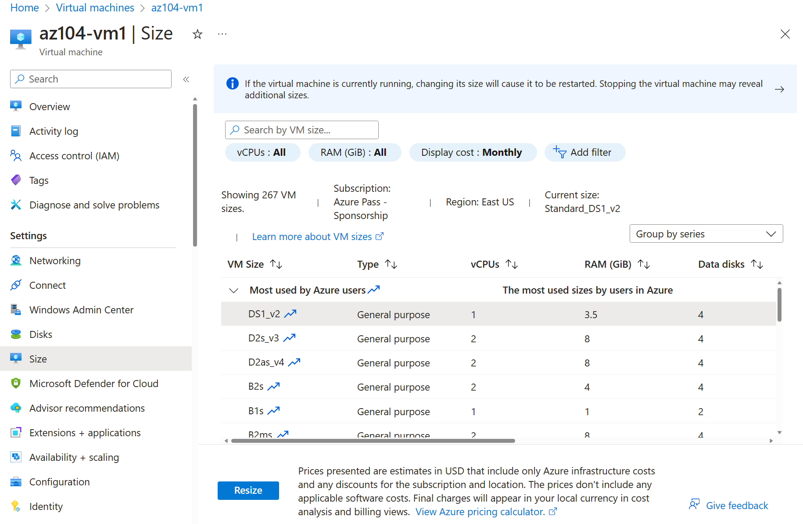

---
lab:
  title: 'Laboratório 08: gerenciar máquinas virtuais'
  module: Administer Virtual Machines
---

# Laboratório 08 – Gerenciar máquinas virtuais

## Introdução ao laboratório

Neste laboratório, você cria e compara máquinas virtuais com conjuntos de dimensionamento de máquinas virtuais. Você aprenderá a criar, configurar e redimensionar uma única máquina virtual. Você aprenderá a criar um conjunto de dimensionamento de máquinas virtuais e configurar o dimensionamento automático.

Este laboratório requer uma assinatura do Azure. Seu tipo de assinatura pode afetar a disponibilidade de recursos neste laboratório. Você pode alterar a região, mas as etapas são escritas usando o **Leste dos EUA**.

## Tempo estimado: 50 minutos

## Cenário do laboratório

Sua organização deseja explorar a implantação e a configuração de máquinas virtuais do Azure. Primeiro, você implementa uma máquina virtual do Azure com dimensionamento manual. Em seguida, implemente um Conjunto de Dimensionamento de Máquinas Virtuais e explore o dimensionamento automático.

## Simulações interativas do laboratório

Há simulações interativas do laboratório que podem ser úteis para este tópico. A simulação permite que você clique em um cenário semelhante em seu próprio ritmo. Há diferenças entre a simulação interativa e este laboratório, mas muitos dos principais conceitos são os mesmos. Não é necessária uma assinatura do Azure.

+ [Crie uma máquina virtual no portal](https://mslearn.cloudguides.com/en-us/guides/AZ-900%20Exam%20Guide%20-%20Azure%20Fundamentals%20Exercise%201). Crie uma máquina virtual, conecte-se e instale a função de servidor Web.

+ [Implante uma máquina virtual com um modelo](https://mslearn.cloudguides.com/en-us/guides/AZ-900%20Exam%20Guide%20-%20Azure%20Fundamentals%20Exercise%209). Explore a galeria de Início Rápido e encontrar um modelo de máquina virtual. Implante o modelo e verifique a implantação.

+ [Criar uma máquina virtual com PowerShell](https://mslearn.cloudguides.com/en-us/guides/AZ-900%20Exam%20Guide%20-%20Azure%20Fundamentals%20Exercise%2010). Usar o Azure PowerShell para implantar uma máquina virtual. Analise as recomendações do Assistente do Azure.

+ [Crie uma máquina virtual com a CLI](https://mslearn.cloudguides.com/en-us/guides/AZ-900%20Exam%20Guide%20-%20Azure%20Fundamentals%20Exercise%2011). Use a CLI para implantar uma máquina virtual. Analise as recomendações do Assistente do Azure.

## Habilidades de trabalho

+ Tarefa 1: implantar máquinas virtuais do Azure resilientes usando o portal do Azure.
+ Tarefa 2: gerenciar o dimensionamento de computação e armazenamento para máquinas virtuais.
+ Tarefa 3: criar e configurar conjuntos de dimensionamento de máquinas virtuais do Azure.
+ Tarefa 4: dimensionar os conjuntos de dimensionamento de máquinas virtuais do Azure.
+ Tarefa 5: Crie uma máquina virtual usando o Azure PowerShell (opcional 1).
+ Tarefa 6: Criar uma máquina virtual usando a CLI (opcional 2).

## Diagrama de Arquitetura de Máquinas Virtuais do Azure


## Tarefa 1: Implante máquinas virtuais do Azure resilientes à zona usando o portal do Azure

Nesta tarefa, você implantará duas máquinas virtuais do Azure em zonas de disponibilidade diferentes usando o portal do Azure. As zonas de disponibilidade oferecem o mais alto nível de SLA de tempo de atividade para máquinas virtuais, com 99,99%. Para atingir esse SLA, você deve implantar pelo menos duas máquinas virtuais em zonas de disponibilidade diferentes.

1. Entre no portal do Azure – `https://portal.azure.com`.

1. Pesquise e selecione `Virtual machines`, na folha **Máquinas virtuais**, clique em **+ Criar** e selecione **Máquina virtual do Azure** no menu suspenso. Observe suas outras opções.

1. Na guia **Noções básicas**, no menu suspenso **Zona de disponibilidade**, coloque uma marca de verificação perto de**Zona 2**. Isso deve selecionar a **Zona 1** e a **Zona 2**.

    >**Observação**: Isso implantará duas máquinas virtuais na região selecionada, uma em cada zona. Você atinge o SLA de 99,99% de tempo de atividade porque tem pelo menos duas VMs distribuídas em pelo menos duas zonas. No cenário em que você pode precisar de apenas uma VM, é uma prática recomendada ainda implantar a VM em outra zona.

1. Na guia Noções básicas, continue concluindo a configuração:

    | Configuração | Valor |
    | --- | --- |
    | Assinatura | o nome da sua assinatura do Azure |
    | Grupo de recursos |  **az104-rg8** (Se necessário, clique em **Criar nova**) |
    | Nomes de máquina virtual | `az104-vm1` e `az104-vm2` (Depois de selecionar ambas as zonas de disponibilidade, selecione **Editar nomes** no campo Nome da VM.) |
    | Region | **Leste dos EUA** |
    | Opções de disponibilidade | **Zona de disponibilidade** |
    | Zona de disponibilidade | **Zona 1, 2** (leia a nota sobre o uso de conjuntos de dimensionamento de máquinas virtuais) |
    | Tipo de segurança | **Standard** |
    | Imagem | **Datacenter do Windows Server 2019 – x64 Gen2** |
    | Instância do Azure Spot | **unchecked** |
    | Tamanho | **Standard D2s v3** |
    | Nome de usuário | `localadmin` |
    | Senha | **Forneça uma senha segura** |
    | Porta de entrada públicas | **Nenhuma** |
    | Deseja usar uma licença existente do Windows Server? | **Desmarcado** |

    

1. Clique em **Avançar: Discos >**, especifique as seguintes configurações (deixe as outras com seus valores padrão):

    | Configuração | Valor |
    | --- | --- |
    | Tipo de disco de SO | **SSD Premium** |
    | Excluir com VM | **marcada** (padrão) |
    | Habilitar a compatibilidade com o Disco Ultra | **Desmarcado** |

1. Clique em **Avançar: Rede >** assume os padrões, mas não fornecem um balanceador de carga.

    | Configuração | Valor |
    | --- | --- |
    | Excluir o IP público e a NIC quando a VM for excluída | **Verificado** |
    | Opções de balanceamento de carga | **Nenhuma** |


1. Clique em **Avançar: Gerenciamento >** e especifique as seguintes configurações (deixe as outras com seus valores padrão):

    | Configuração | Valor |
    | --- | --- |
    | Opções de orquestração de patch | **Orquestrado pelo Azure** |  

1. Clique em **Avançar: Monitoramento >** e especifique as seguintes configurações (deixe as outras com seus valores padrão):

    | Configuração | Valor |
    | --- | --- |
    | Diagnóstico de inicialização | **Desabilitar** |

1. Clique em **Avançar: Avançado >**, pegue os padrões e clique em **Revisão + Criar**.

1. Após a validação, selecione **Criar**.

    >**Observação:** Observe como a máquina virtual implanta a NIC, o disco e o endereço IP público (se configurado) são recursos criados e gerenciados independentemente.

1. Aguarde a conclusão da implantação e selecione **Ir para o recurso**.

   >**Observação:** Monitore as mensagens de **Notificação**.

## Tarefa 2: Gerencie o dimensionamento de computação e armazenamento para máquinas virtuais

Nesta tarefa, você dimensionará uma máquina virtual ajustando seu tamanho para uma SKU diferente. O Azure fornecerá flexibilidade na seleção de tamanho de VM para que você possa ajustar uma VM por períodos, se ela precisar de mais (ou menos) computação e memória alocada. Esse conceito é estendido aos discos, onde você pode modificar o desempenho do disco ou aumentar a capacidade alocada.

1. Na máquina virtual **az104-vm1**, na folha **Disponibilidade + dimensionamento**, selecione **Tamanho**.

1. Defina o tamanho da máquina virtual como **DS1_v2** e clique em **Redimensionar**. Ao ser solicitado, confirme a alteração.

    >**Observação**: escolha outro tamanho se o **DS1_v2 Standard** não estiver disponível. O redimensionamento também é conhecido como dimensionamento vertical, para cima ou para baixo.

    

1. Na área **Configurações**, selecione **Discos**.

1. Em **Discos de dados**, selecione **+Criar e anexar um disco**. Defina as configurações (deixe outras configurações em seus valores padrão).

    | Configuração | Valor |
    | --- | --- |
    | Nome do disco | `vm1-disk1` |
    | Tipo de armazenamento | **HDD Standard** |
    | Tamanho (GiB) | `32` |

1. Clique em **Aplicar**.

1. Depois que o disco tiver sido criado, clique em **Desanexar** (se necessário, role para a direita para exibir o ícone de desanexação) e clique em **Aplicar**.

    >**Observação**: A desanexação remove o disco da VM, mas o mantém no armazenamento para uso posterior.

1. Pesquise e selecione `Disks`. Na lista de discos, selecione o objeto **vm1-disk1**.

    >**Observação:** A folha **Visão geral** também fornece informações de desempenho e uso para o disco.

1. Na folha **Configurações**, selecione **Tamanho + desempenho**.

1. Defina o tipo de armazenamento como **SSD Standard** e clique em **Salvar**.

1. Navegue de volta para a máquina virtual **az104-vm1** e selecione **Discos**.

1. Na seção **Disco de Dados**, selecione **Anexar discos existentes**.

1. No menu suspenso **Nome do disco**, selecione **VM1-DISK1**. 

1. Verifique se o disco agora é **SSD Standard**.

1. Selecione **Aplicar** para salvar as alterações. 

    >**Observação:** Agora, você criou uma máquina virtual, dimensionou a SKU e o tamanho do disco de dados. Na próxima tarefa, usamos Conjuntos de Dimensionamento de Máquinas Virtuais para automatizar o processo de dimensionamento.

## Diagrama de Arquitetura de Conjuntos de Dimensionamento de Máquinas Virtuais do Azure


## Tarefa 3: Criar e configurar Conjuntos de Dimensionamento de Máquinas Virtuais do Azure

Nesta tarefa, você implantará um conjunto de dimensionamento de máquinas virtuais do Azure entre zonas de disponibilidade. Os Conjuntos de Dimensionamento de Máquinas Virtuais reduzem a sobrecarga administrativa da automação, permitindo que você configure métricas ou condições que permitam que o conjunto de dimensionamento dimensione, aumente ou reduza horizontalmente.

1. No portal do Azure, pesquise e selecione `Virtual machine scale sets` e, na folha **Conjunto de dimensionamento de máquinas virtuais**, clique em **+ Criar**.

1. Na guia **Noções básicas** da folha **Criar conjuntos de dimensionamento de máquinas virtuais**, especifique as seguintes configurações (deixe outras com seus valores padrão) e clique em **Avançar: Spot >**:

    | Configuração | Valor |
    | --- | --- |
    | Assinatura | o nome da sua assinatura do Azure  |
    | Grupo de recursos | **az104-rg8**  |
    | Nome do conjunto de dimensionamento de máquinas virtuais | `vmss1` |
    | Region | **(EUA) Leste dos EUA** |
    | Zona de disponibilidade | **Zonas 1, 2, 3** |
    | Modo de orquestração | **Uniforme** |
    | Tipo de segurança | **Standard** |
    | Imagem | **Datacenter do Windows Server 2019 – x64 Gen2** |
    | Executar com desconto do Spot do Azure | **Desmarcado** |
    | Tamanho | **Standard D2s_v3** |
    | Nome de usuário | `localadmin` |
    | Senha | **Forneça uma senha segura**  |
    | Já tem uma licença do Windows Server? | **Desmarcado** |

    >**Observação**: para obter a lista de regiões do Azure que oferecem suporte à implantação de máquinas virtuais do Windows em zonas de disponibilidade, consulte [O que são zonas de disponibilidade no Azure?](https://docs.microsoft.com/en-us/azure/availability-zones/az-overview)

    

1. Na guia **Spot**, aceite os padrões e selecione **Avançar: Discos >**.

1. Na guia **Discos**, aceite os valores padrão e clique em **Avançar: Rede >**.

1. Na página **Rede**, clique no link **Criar rede virtual** abaixo da caixa de texto **Rede virtual** e crie uma nova rede virtual com as seguintes configurações (deixe outras pessoas com seus valores padrão).  Ao terminar, selecione **OK**.

    | Configuração | Valor |
    | --- | --- |
    | Nome | `vmss-vnet` |
    | Intervalo de endereços | `10.82.0.0/20` (alterar o que está lá) |
    | Nome da sub-rede | `subnet0` |
    | Intervalo de sub-rede | `10.82.0.0/24` |

1. Na guia **Rede**, clique no ícone **Editar interface de rede** à direita da entrada do adaptador de rede.

1. Para a seção **Grupo de segurança de rede NIC**, selecione **Avançado** e clique em **Criar novo** na lista suspensa **Configurar grupo de segurança de rede**.

1. No painel **Criar grupo de segurança de rede**, especifique as seguintes configurações (deixe as outras com seus valores padrão):

    | Configuração | Valor |
    | --- | --- |
    | Nome | **vmss1-nsg** |

1. Clique em **Adicionar uma regra de entrada**e adicione uma regra de segurança de entrada com as seguintes configurações (deixe as outras com seus valores padrão):

    | Configuração | Valor |
    | --- | --- |
    | Fonte | **Qualquer** |
    | Intervalos de portas de origem | * |
    | Destino | **Qualquer** |
    | Serviço | **HTTP** |
    | Ação | **Permitir** |
    | Prioridade | **1010** |
    | Nome | `allow-http` |

1. Clique em **Adicionar** e, novamente no painel **Criar grupo de segurança de rede**, clique em **OK**.

1. Na folha **Editar interface de rede**, na seção **Endereço IP público**, clique em **Habilitado** e em **OK**.

1. Na guia **Rede**, na seção **Balanceamento de carga**, especifique o seguinte (deixe outras pessoas com seus valores padrão).

    | Configuração | Valor |
    | --- | --- |
    | Opções de balanceamento de carga | **Balanceador de carga do Azure** |
    | Selecionar um balanceador de carga | **Criar um balanceador de carga** |

1. Na página **Criar um balanceador de carga**, especifique o nome do balanceador de carga e use os padrões. Clique em **Criar** quando terminar e, em seguida, em **Avançar : Dimensionamento >**.

    | Configuração | Valor |
    | --- | --- |
    | Nome do balanceador de carga | `vmss-lb` |

    >**Observação:** Pause por um minuto e examine o que você fez. Neste ponto, você configurou o conjunto de dimensionamento de máquina virtual com discos e rede. Na configuração de rede, você criou um grupo de segurança de rede e permitiu HTTP. Você também criou um balanceador de carga com um endereço IP público.

1. Na guia **Dimensionamento**, especifique as seguintes configurações (deixe as outras com seus valores padrão) e clique em **Avançar: Gerenciamento >**:

    | Configuração | Valor |
    | --- | --- |
    | Contagem de instâncias inicial | `2` |
    | Política de dimensionamento | **Manual** |

1. Na guia **Gerenciamento**, especifique as seguintes configurações (deixe as outras com seus valores padrão):

    | Configuração | Valor |
    | --- | --- |
    | Diagnóstico de inicialização | **Desabilitar** |

1. Clique em **Avançar: Integridade >**.

1. Na guia **Integridade**, examine as configurações padrão sem fazer alterações e clique em **Avançar: Avançado >**.

1. Na guia **Avançado**, clique em **Examinar + criar**.

1. Na guia **Examinar + criar**, verifique se a validação foi aprovada e clique em **Criar**.

    >**Observação**: aguarde a conclusão da implantação do conjunto de dimensionamento de máquinas virtuais. Isso deve levar aproximadamente 5 minutos. Enquanto aguarda, examine a [documentação](https://learn.microsoft.com/azure/virtual-machine-scale-sets/overview).

## Tarefa 4: Dimensione os Conjuntos de Dimensionamento de Máquinas Virtuais do Azure

Nesta tarefa, você dimensiona o conjunto de dimensionamento de máquinas virtuais usando uma regra de dimensionamento personalizado.

1. Selecione **Ir para o recurso** ou procure e selecione o conjunto de dimensionamento **vmss1**.

1. Escolha **Colocação em escala** no menu à esquerda da janela do conjunto de dimensionamento.

>**Você sabia?** Você pode fazer o **Dimensionamento manual** ou o **Dimensionamento automático personalizado**. Em conjuntos de dimensionamento com um pequeno número de instâncias de VM, aumentar ou diminuir a contagem de instâncias (dimensionamento manual) pode ser melhor. Em conjuntos de dimensionamento com um grande número de instâncias de VM, o dimensionamento com base em métricas (dimensionamento automático personalizado) pode ser mais apropriado.

### Regra de escala horizontal

1. Selecione **Dimensionamento automático personalizado**. Em seguida, altere o **Modo de dimensionamento** para **Dimensionamento com base em métrica**. Depois, selecione **Adicionar uma regra**.

1. Vamos criar uma regra que aumenta automaticamente o número de instâncias de VM. Essa regra é dimensionada quando a carga média da CPU é maior que 70% em um período de 10 minutos. Quando a regra dispara, o número de instâncias de VM aumentará em 20%.

    | Configuração | Valor |
    | --- | --- |
    | Origem da métrica | **Recurso atual (vmss1)** |
    | Namespace da métrica | **Host de Máquina Virtual** |
    | Nome da métrica | **Porcentagem de CPU** (examine as outras opções) |
    | Operador | **Maior que** |
    | Limite de métrica para disparar ação de escala | **70** |
    | Duração (minutos) | **10** |
    | Estatística de intervalo de agregação | **Média** |
    | Operação | **Aumentar percentual em** (Examine as outras opções) |
    | Tempo de resfriamento (minutos) | **5** |
    | Percentual | **20** |

    

1. Não se esqueça de **Salvar** suas alterações.

### Regra de reduzir horizontalmente

1. Durante as noites ou fins de semana, a demanda pode diminuir, por isso é importante criar uma regra de reduzir horizontalmente.

1. Vamos criar uma regra que diminua o número de instâncias de VM em um conjunto de dimensionamento. O número de instâncias deve diminuir quando a carga média da CPU cair abaixo de 30% em um período de 10 minutos. Quando a regra dispara, o número de instâncias de VM é reduzido em 20%.

1. Selecione **Adicionar uma regra**, ajuste as configurações e selecione **Adicionar**.

    | Configuração | Valor |
    | --- | --- |
    | Operador | **Menor que** |
    | Limite | **30** |
    | Operação | **diminuir a porcentagem por** (examine suas outras opções) |
    | Percentual | **20** |

1. Não se esqueça de **Salvar** suas alterações.

### Definir os limites de instância

1. Quando suas regras de dimensionamento automático são aplicadas, os limites de instância garantem que você não expanda além do número máximo de instâncias ou dimensione além do número mínimo de instâncias.

1. Os **limites de instância** são mostrados na página **Dimensionamnto** após as regras.

    | Configuração | Valor |
    | --- | --- |
    | Mínimo | **2** |
    | Máximo | **10** |
    | Default | **2** |

1. Certifique-se de **Salvar** suas alterações

1. Na página **vmss1**, selecione **Instâncias**. É aqui que você monitoraria o número de instâncias de máquina virtual.

    >**Observação:** Se você estiver interessado em usar o Azure PowerShell para a criação de máquinas virtuais, tente a Tarefa 5. Se você estiver interessado em usar a CLI para criar máquinas virtuais, tente a Tarefa 6.

## Tarefa 5: criar uma máquina virtual usando o Azure PowerShell (opção 1)

1. Use o ícone (canto superior direito) para iniciar uma sessão do **Cloud Shell**. Como alternativa, navegue diretamente para `https://shell.azure.com`.

1. Certifique-se de selecionar **PowerShell**. Se necessário, configure o armazenamento do shell.

1. Execute o comando a seguir para criar uma máquina virtual. Quando solicitado, forneça um nome de usuário e uma senha para a VM. Enquanto você espera, confira a referência de comando [New-AzVM](https://learn.microsoft.com/powershell/module/az.compute/new-azvm?view=azps-11.1.0) para todos os parâmetros associados à criação de uma máquina virtual.

    ```powershell
    New-AzVm `
    -ResourceGroupName 'az104-rg8' `
    -Name 'myPSVM' `
    -Location 'East US' `
    -Image 'Win2019Datacenter' `
    -Zone '1' `
    -Size 'Standard_D2s_v3' ` 
    -Credential (Get-Credential)
    ```

1. Quando o comando for concluído, use **Get-AzVM** para listar as máquinas virtuais no grupo de recursos.

    ```powershell
    Get-AzVM `
    -ResourceGroupName 'az104-rg8' `
    -Status
    ```

1. Verifique se a nova máquina virtual está listada e se o **Status** está **em execução**.

1. Use **Stop-AzVM** para desalocar sua máquina virtual. Digite **Sim** para confirmar.

    ```powershell
    Stop-AzVM `
    -ResourceGroupName 'az104-rg8' `
    -Name 'myPSVM' 
    ```

1. Use **Get-AzVM** com o parâmetro **-Status** para verificar se a máquina está **desalocada**.

    >**Você sabia?** Quando você usa o Azure para parar sua máquina virtual, o status é *desalocado*. Isso significa que todos os IPs públicos não estáticos são liberados, e você para de pagar pelos custos de computação da VM.

## Tarefa 6: Criar uma máquina virtual usando a CLI (opção 2)

1. Use o ícone (canto superior direito) para iniciar uma sessão do **Cloud Shell**. Como alternativa, navegue diretamente para `https://shell.azure.com`.

1. Selecione **Bash**. Se necessário, configure o armazenamento do shell.

1. Execute o comando a seguir para criar uma máquina virtual. Quando solicitado, forneça um nome de usuário e uma senha para a VM. Enquanto você espera, confira a referência de comando [az vm create](https://learn.microsoft.com/cli/azure/vm?view=azure-cli-latest#az-vm-create) para todos os parâmetros associados à criação de uma máquina virtual.

    ```sh
    az vm create --name myCLIVM --resource-group az104-rg8 --image Ubuntu2204 --admin-username localadmin --generate-ssh-keys
    ```

1. Quando o comando for concluído, use **az vm show** para verificar se sua máquina foi criada.

    ```sh
    az vm show --name  myCLIVM --resource-group az104-rg8 --show-details
    ```

1. Verifique se o **powerState** está **Em execução na VM**.

1. Use **az vm deallocate** para desalocar sua máquina virtual. Digite **Sim** para confirmar.

    ```sh
    az vm deallocate --resource-group az104-rg8 --name myCLIVM
    ```

1. Use **az vm show** para garantir que o **powerState** seja **desalocado na VM**.

    >**Você sabia?** Quando você usa o Azure para parar sua máquina virtual, o status é *desalocado*. Isso significa que todos os IPs públicos não estáticos são liberados, e você para de pagar pelos custos de computação da VM.

## Limpar os recursos

Se você estiver trabalhando com **sua própria assinatura**, reserve um minuto para excluir os recursos do laboratório. Isso garantirá que os recursos sejam liberados e que o custo seja minimizado. A maneira mais fácil de excluir os recursos do laboratório é excluir o grupo de recursos do laboratório. 

+ No portal do Azure, selecione o grupo de recursos, selecione **Excluir o grupo de recursos**, **Inserir o nome do grupo de recursos** e clique em **Excluir**.
+ Usar o Azure PowerShell, `Remove-AzResourceGroup -Name resourceGroupName`.
+ Usar a CLI, `az group delete --name resourceGroupName`.

## Estender seu aprendizado com o Copilot
O Copilot pode ajudar você a aprender a usar as ferramentas de script do Azure. O Copilot também pode ajudar em áreas não cobertas no laboratório ou onde você precisar de mais informações. Abra um navegador do Edge e escolha Copilot (canto superior direito) ou navegue até *copilot.microsoft.com*. Reserve alguns minutos para experimentar essas solicitações.

+ Forneça as etapas e os comandos da CLI do Azure para criar uma máquina virtual do Linux. 
+ Revise as maneiras pelas quais você pode escalar máquinas virtuais e melhorar o desempenho.
+ Descreva as políticas de gerenciamento do ciclo de vida do armazenamento do Azure e como elas podem otimizar os custos.

## Saiba mais com treinamento individual

+ [Crie uma máquina virtual do Windows no Azure](https://learn.microsoft.com/training/modules/create-windows-virtual-machine-in-azure/). Criar uma máquina virtual do Windows usando o portal do Azure. Conectar-se a uma máquina virtual do Windows em execução usando a Área de Trabalho Remota
+ [Crie um aplicativo escalonável com os Conjuntos de Dimensionamento de Máquinas Virtuais](https://learn.microsoft.com/training/modules/build-app-with-scale-sets/). Permita que seu aplicativo se ajuste automaticamente às alterações de carga, minimizando os custos com os Conjuntos de Dimensionamento de Máquinas Virtuais.
+ [Conectar-se a máquinas virtuais através do portal do Microsoft Azure usando o Azure Bastion](https://learn.microsoft.com/en-us/training/modules/connect-vm-with-azure-bastion/). Implante o Azure Bastion para se conectar com segurança às máquinas virtuais do Azure diretamente no portal do Azure, para substituir de forma eficaz uma solução de Jumpbox existente, monitorar sessões remotas usando logs de diagnóstico e gerenciar sessões remotas ao desconectar uma sessão do usuário.

## Principais aspectos a serem lembrados

Parabéns por concluir o laboratório. Aqui estão as principais lições deste laboratório.

+ As máquinas virtuais do Azure são recursos de computação escalonáveis sob demanda.
+ As máquinas virtuais do Azure fornecem opções de dimensionamento vertical e horizontal.
+ Configurar máquinas virtuais do Azure inclui escolher um sistema operacional, tamanho, armazenamento e configurações de rede.
+ Os Conjuntos de Dimensionamento de Máquinas Virtuais permitem criar e gerenciar um grupo de VMs com balanceamento de carga.
+ As máquinas virtuais em um Conjunto de Dimensionamento de Máquinas Virtuais são criadas na mesma imagem e configuração.
+ Em um Conjunto de Dimensionamento de Máquinas Virtuais, o número de instâncias de VM pode aumentar ou diminuir automaticamente em resposta à demanda ou a um agendamento definido.
