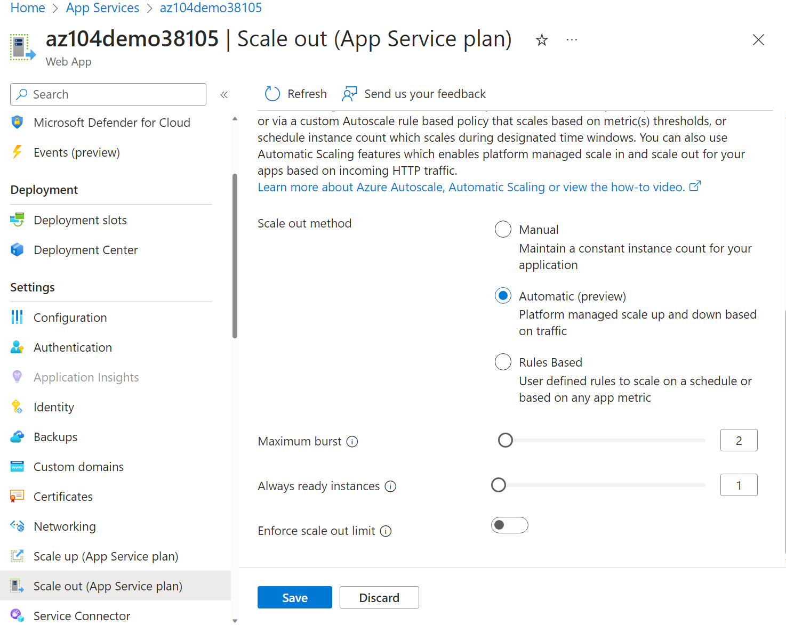

---
lab:
  title: 'Laboratório 09a: Implementar Aplicativos Web'
  module: Administer PaaS Compute Options
---

# Laboratório 09a - Implementar Aplicativos Web

## Introdução ao laboratório

Neste laboratório, você aprenderá sobre os aplicativos Web do Azure. Você aprenderá a configurar um aplicativo Web para exibir um aplicativo Olá, Mundo em um repositório externo do GitHub. Você aprenderá a criar um slot de preparo e trocar pelo slot de produção. Você também aprenderá sobre o dimensionamento automático para acomodar as alterações de demanda.

Este laboratório requer uma assinatura do Azure. Seu tipo de assinatura pode afetar a disponibilidade de recursos neste laboratório. Você pode alterar a região, mas as etapas são escritas usando o Leste dos EUA.

## Tempo estimado: 20 minutos

## Cenário do laboratório

Sua organização está interessada nos aplicativos Web do Azure para hospedar seus sites da empresa. Atualmente, os sites estão hospedados em um data center local. Os sites estão em execução em servidores Windows usando a pilha de runtime do PHP. O hardware está se aproximando do fim da vida útil e em breve precisará ser substituído. Sua organização deseja evitar novos custos de hardware usando o Azure para hospedar os sites. 

## Simulações interativas do laboratório

>**Observação**: as simulações de laboratório fornecidas anteriormente foram desativadas.

## Diagrama de arquitetura

## Habilidades de trabalho

+ Tarefa 1: Criar e configurar um aplicativo Web do Azure.
+ Tarefa 2: Criar e configurar um slot de implantação.
+ Tarefa 3: definir configurações de implantação do aplicativo Web.
+ Tarefa 4: Trocar os slots de implantação.
+ Tarefa 5: Configurar e testar o dimensionamento automático do aplicativo Web do Azure.

## Tarefa 1: Criar e configurar um aplicativo Web do Azure

Nesta tarefa, você cria um aplicativo Web do Azure. Os Serviços de Aplicativo do Azure são uma solução de Plataforma como Serviço (PAAS) para aplicativos Web, móveis e outros aplicativos baseados na Web. Os aplicativos Web do Azure fazem parte dos Serviços de Aplicativo do Azure que hospedam a maioria dos ambientes de runtime, como PHP, Java e .NET. O plano de serviço do aplicativo selecionado determina a computação, o armazenamento e os recursos do aplicativo Web. 

1. Entre no **portal do Azure** - `https://portal.azure.com`.

1. Pesquise e selecione `App services`.

1. Selecione **+ Criar**, no menu suspenso, **Aplicativo Web**. Observe as outras opções. 

1. Na guia **Básico** da folha **Criar Aplicativo Web**, defina as seguintes configurações (deixe as outras com seus valores padrão):

    | Configuração | Valor |
    | --- | ---|
    | Subscription | sua assinatura do Azure |
    | Resource group | `az104-rg9` (Se necessário, selecione **Criar novo**) |
    | Nome do aplicativo Web | qualquer nome globalmente exclusivo |
    | Publicação | **Código** |
    | Pilha de runtime | **PHP 8.2** |
    | Sistema operacional | **Linux** |
    | Region | **Leste dos EUA** |
    | Planos de preços | **Premium V3 P1V3** |
    | Redundância de zona | aceite os padrões |

 1. Clique em **Examinar + criar** e, em seguida, **Criar**.

    >**Observação**: Aguarde até que o aplicativo Web seja criado para prosseguir para a próxima tarefa. Isso deverá levar cerca de um minuto.
    
    >**Observação**: se a implantação falhar, mude para outra região e tente novamente. Isso se deve às cotas em diferentes regiões.  

1. Após a implantação, selecione **Acessar recurso**.

## Tarefa 2: Criar e configurar um slot de implantação

Nesta tarefa, você criará um slot de implantação de preparo. Os slots de implantação permitem que você execute testes antes de disponibilizar seu aplicativo para o público (ou seus usuários finais). Depois de executar o teste, você poderá trocar o slot de desenvolvimento ou de preparação pelo de produção. Muitas organizações usam slots para realizar testes de pré-produção. Além disso, muitas organizações executam vários slots para cada aplicativo (por exemplo, desenvolvimento, garantia de qualidade, teste e produção).

1. Na folha do aplicativo Web recém-implantado, clique no link **Domínio padrão** para exibir a página da Web padrão em uma nova guia do navegador.

1. Feche a nova guia do navegador e, no portal do Azure, na seção **Implantação** da folha Aplicativo Web, clique em **Slots de implantação**.

1. Clique em **Adicionar slot** e adicione um novo slot com as seguintes configurações:

    | Configuração | Valor |
    | --- | ---|
    | Nome | `staging` |
    | Clone as configurações de | **Não clonar as configurações**|

1. Selecione **Adicionar** para criar o slot.

1. Atualize a página para exibir os slots de produção e preparo. 

1. Selecione a entrada que representa o slot de preparo recém-criado.

    >**Observação**: isso abrirá o painel exibindo as propriedades do slot de preparo.

1. Examine a folha do slot de preparo e observe que sua URL é diferente daquela atribuída ao slot de produção.

## Tarefa 3: Definir as configurações de implantação do Aplicativo Web

Nesta tarefa, você definirá as configurações de implantação do aplicativo Web. As configurações de implantação permitem a implantação contínua. Isso garante que o serviço de aplicativo tenha a versão mais recente do aplicativo.

1. No slot de preparo, selecione **Centro de implantação** e selecione **Configurações**.

    >**Observação:** Verifique se você está na folha do slot de preparo (em vez do slot de produção).
    
1. Na lista suspensa **Fonte**, selecione **Git externo**. Observe as outras opções. 

1. No campo repositório, insira `https://github.com/Azure-Samples/php-docs-hello-world`

1. No campo ramificação, insira `master`.

1. Selecione **Salvar**.

1. No slot de preparo, selecione **Visão geral**.

1. Selecione o link **Domínio padrão** e abra o URL em uma nova guia. 

1. Verifique se o slot de preparo exibe **Olá, Mundo**. 

>**Observação:** A implantação pode levar um minuto. Certifique-se de **Atualizar** a página do aplicativo.

## Tarefa 4: Trocar os slots de implantação

Nesta tarefa, você trocará o slot de preparo pelo slot de produção. A troca de um slot permite que você use o código testado no slot de preparo e mova-o para a produção. O portal do Azure também solicitará se você precisar mover outras configurações de aplicativo que você personalizou para o slot. Trocar slots é uma tarefa comum para as equipes de aplicativos e equipes de suporte a aplicativos, especialmente aquelas que implantam atualizações de aplicativos de rotina e correções de bugs.

1. Navegue de volta para a folha **Slots de implantação** e selecione **Trocar**.

1. Examine as configurações padrão e clique em **Iniciar a Troca**. Aguarde a notificação de que a troca foi concluída.

1. Retorne à home page do portal. Você terá um aplicativo Web de produção e o slot de preparo.

1. Pesquise `App Services` e selecione o seu aplicativo Web do Serviço de Aplicativo. Isso levará você de volta ao slot Implantação de Produção.

1. Na folha **Visão geral** do aplicativo Web do Serviço de Aplicativo, selecione o link do **Domínio padrão** para exibir a home page do site.

1. Verifique se a página da Web de produção exibe o **Olá, Mundo!** .

    >**Observação:** Copie o **URL** do domínio padrão. Você precisará dele para o teste de carga da próxima tarefa. 

## Tarefa 5: Configurar e testar o dimensionamento automático do aplicativo Web do Azure

Nesta tarefa, você configurará o dimensionamento automático do aplicativo Web do Azure. O dimensionamento automático permite que você mantenha o desempenho ideal para seu aplicativo Web quando o tráfego para o aplicativo Web aumenta. Para determinar quando o aplicativo deve ser dimensionado, você poderá monitorar métricas como uso da CPU, memória ou largura de banda.

1. Na seção **Configurações**, selecione **Escalar horizontalmente (Plano do Serviço de Aplicativo)**.

    >**Observação:** Certifique-se de que você está trabalhando no slot de produção e não no slot de preparo.  

1. Na seção **Dimensionamento**, selecione **Automático**. Observe a opção **Baseado em regras**. O dimensionamento baseado em regras pode ser configurado para diferentes métricas de aplicativos. 

1. No campo **Máximo de intermitência**, selecione **2**.

    

1. Selecione **Salvar**.

1. Selecione **Diagnosticar e solucionar problemas** (painel esquerdo).

1. Na caixa **Executar teste de carga do aplicativo**, selecione **Criar teste de carga**.

    + Selecione **+ Criar** e dê um **nome** ao seu teste de carga.  O nome deve ser exclusivo.
    + Selecione **Examinar + criar** e depois **Criar**.

1. Aguarde até que o teste de carga seja criado e selecione **Ir para recurso**.

1. Em **Visão geral** | **Criar adicionando solicitações HTTP**, selecione **Criar**.

1. Na guia **Plano de teste**, clique em **Adicionar solicitação**. No campo **URL**, cole o **Domínio padrão** URL. Certifique-se de que isso esteja formatado corretamente e comece com **https://**. Selecione **Adicionar** para salvar as alterações. 

1. Selecione **Examinar + criar** e **Criar**.

    >**Observação:** A criação do teste pode levar alguns minutos. Observe as notificações.

1. Navegue até o teste (ele está listado na home page). 

1. Atualize e revise as métricas dinâmicas, incluindo **Usuários virtuais**, **Tempo de resposta** e **Solicitações/seg**.

1. Selecione **Parar** para concluir a execução do teste. Você não precisa aguardar a conclusão do teste. 

## Limpar os recursos

Se você estiver trabalhando com **sua própria assinatura**, reserve um minuto para excluir os recursos do laboratório. Isso garantirá que os recursos sejam liberados e que o custo seja minimizado. A maneira mais fácil de excluir os recursos do laboratório é excluir o grupo de recursos do laboratório. 

+ No portal do Azure, selecione o grupo de recursos, selecione **Excluir o grupo de recursos**, **Inserir o nome do grupo de recursos** e clique em **Excluir**.
+ Usar o Azure PowerShell, `Remove-AzResourceGroup -Name resourceGroupName`.
+ Usar a CLI, `az group delete --name resourceGroupName`.

## Estender seu aprendizado com o Copilot
O Copilot pode ajudar você a aprender a usar as ferramentas de script do Azure. O Copilot também pode ajudar em áreas não cobertas no laboratório ou onde você precisar de mais informações. Abra um navegador do Edge e escolha Copilot (canto superior direito) ou navegue até *copilot.microsoft.com*. Reserve alguns minutos para experimentar essas solicitações.

+ Resuma as etapas para criar e configurar um aplicativo Web do Azure.
+ Quais são as maneiras de escalar um Aplicativo Web do Azure?

## Saiba mais com treinamento individual

+ [Prepare uma implantação de aplicativo Web para teste e reversão usando slots de implantação do Serviço de Aplicativo](https://learn.microsoft.com/training/modules/stage-deploy-app-service-deployment-slots/). Use slots de implantação para simplificar a implantação e reverter um aplicativo Web no Serviço de Aplicativo do Azure.
+ [Dimensione um aplicativo Web do Serviço de Aplicativo para atender à demanda de modo eficiente com escala vertical e escala horizontal do Serviço de Aplicativo](https://learn.microsoft.com/training/modules/app-service-scale-up-scale-out/). Responda a períodos de maior atividade, aumentando gradualmente os recursos disponíveis e, então, diminuindo esses recursos quando o nível atividades cai para reduzir os custos.

## Principais aspectos a serem lembrados

Parabéns por concluir o laboratório. Aqui estão as principais lições deste laboratório. 

+ Os Serviços de Aplicativo do Azure permitem criar, implantar e dimensionar aplicativos Web rapidamente.
+ O Serviço de Aplicativo inclui suporte para muitos ambientes de desenvolvedor, incluindo ASP.NET, Java, PHP e Python.
+ Os slots de implantação permitem que você crie ambientes separados para implantar e testar seu aplicativo Web.
+ Você pode dimensionar manual ou automaticamente um aplicativo Web para lidar com a demanda adicional.
+ Uma grande variedade de ferramentas de diagnóstico e teste estão disponíveis. 
