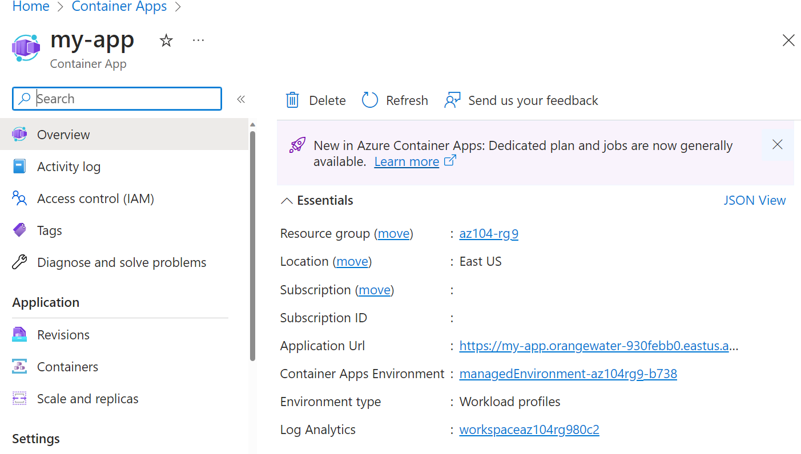

---
lab:
  title: 'Laboratório 09c: Implementar os Aplicativos de Contêiner do Azure'
  module: Administer PaaS Compute Options
---

# Laboratório 09c: implementar os Aplicativos de Contêiner do Azure

## Introdução ao laboratório

Neste laboratório, você aprenderá a implementar e implantar os Aplicativos de Contêiner do Azure.

Este laboratório requer uma assinatura do Azure. Seu tipo de assinatura pode afetar a disponibilidade de recursos neste laboratório. Você pode alterar a região, mas as etapas são escritas usando o **Leste dos EUA**.

## Tempo estimado: 15 minutos

## Cenário do laboratório

Sua organização tem um aplicativo Web que é executado em uma máquina virtual em seu data center local. A organização deseja mover todos os aplicativos para a nuvem, mas não quer ter um grande número de servidores para gerenciar. Você decide avaliar os Aplicativos de Contêiner do Azure.

## Simulações interativas do laboratório

Não há simulações interativas do laboratório para este tópico. 

## Diagrama de arquitetura

## Habilidades de trabalho

- Tarefa 1: Crie e configure um aplicativo de contêiner do Azure e um ambiente.
- Tarefa 2: Teste e verifique a implantação do aplicativo de contêiner do Azure.

## Tarefa 1: Criar e configurar um Aplicativo de Contêiner do Azure e um ambiente

Os Aplicativos de Contêiner do Azure levam o conceito de um cluster Kubernetes gerenciado um passo adiante e gerenciam também o ambiente do cluster, além de fornecerem outros serviços gerenciados sobre o cluster. Ao contrário de um cluster do Kubernetes no Azure, onde você ainda precisa gerenciar o cluster, uma instância dos Aplicativos de Contêiner do Azure remove parte da complexidade na configuração de um cluster do Kubernetes.

1. No portal do Azure, pesquise e selecione `Container Apps`.

1. Em **Aplicativos de Contêiner**, selecione **Criar**.

1. Use as informações a seguir para preencher os detalhes na guia **Básico**.*.

    | Configuração | Ação |
    |---|---|
    | Assinatura | Selecione sua Assinatura do Azure. |
    | Grupo de recursos | `az104-rg9` |
    | Nome do aplicativo de contêiner |  `my-app` |
    | Region    | **Leste dos EUA** (ou uma região disponível perto de você) |
    | Ambiente de Aplicativos de Contêiner | Clique em **Criar novo** > Definir Nome do ambiente como **my-environment** > **Criar** |

1. Na guia **Contêiner**, verifique se **Uso da imagem de início rápido** está habilitado e se a imagem de início rápido está definida como **Simples contêiner olá mundo**.

1. Selecione **Examinar e criar** e, em seguida, **Criar**.

    >**Observação:** Aguarde a implantação do aplicativo de contêiner. Isso levará alguns minutos. 
 
## Tarefa 2: Testar e verificar a implantação do aplicativo de contêiner do Azure

Por padrão, o aplicativo de contêiner do Azure que você criar aceitará o tráfego na porta 80 usando o aplicativo de exemplo “Olá, Mundo”. Os Aplicativos de Contêiner do Azure fornecerão um nome DNS para o aplicativo. Copie e navegue até essa URL para garantir que o aplicativo esteja em execução.

1. Selecione **Ir para o recurso** para exibir o novo aplicativo de contêiner.

1. Selecione o link ao lado de *URL do Aplicativo* para exibir o aplicativo.

    

1. Verifique se você recebeu a mensagem **Seu aplicativo dos Aplicativos de Contêiner do Azure está ativo**.
   
## Limpar os recursos

Se você estiver trabalhando com **sua própria assinatura**, reserve um minuto para excluir os recursos do laboratório. Isso garantirá que os recursos sejam liberados e que o custo seja minimizado. A maneira mais fácil de excluir os recursos do laboratório é excluir o grupo de recursos do laboratório. 

+ No portal do Azure, selecione o grupo de recursos, selecione **Excluir o grupo de recursos**, **Inserir o nome do grupo de recursos** e clique em **Excluir**.
+ Usar o Azure PowerShell, `Remove-AzResourceGroup -Name resourceGroupName`.
+ Usar a CLI, `az group delete --name resourceGroupName`.

## Estender seu aprendizado com o Copilot
O Copilot pode ajudar você a aprender a usar as ferramentas de script do Azure. O Copilot também pode ajudar em áreas não cobertas no laboratório ou onde você precisar de mais informações. Abra um navegador do Edge e escolha Copilot (canto superior direito) ou navegue até *copilot.microsoft.com*. Reserve alguns minutos para experimentar essas solicitações.

+ Resuma as etapas para criar e configurar um Aplicativo de Contêiner do Azure.
+ Compare e contraste os Aplicativos de Contêiner do Azure com o Serviço de Kubernetes do Azure.

## Saiba mais com treinamento individual

+ [Configure um aplicativo de contêiner nos Aplicativos de Contêiner do Azure](https://learn.microsoft.com/training/modules/configure-container-app-azure-container-apps/). Examina os recursos e as capacidades dos Aplicativos de Contêiner do Azure e se concentra em como criar, configurar, dimensionar e gerenciar aplicativos de contêiner usando os Aplicativos de Contêiner do Azure.

## Principais aspectos a serem lembrados

Parabéns por concluir o laboratório. Aqui estão as principais lições deste laboratório. 

+ Os Aplicativos de Contêiner do Azure (ACA) são uma plataforma sem servidor que permite manter menos infraestrutura e economizar custos durante a execução de aplicativos conteinerizados.
+ Os Aplicativos de Contêiner fornecem a configuração do servidor, a orquestração de contêineres e os detalhes da implantação. 
+ As cargas de trabalho nos ACA geralmente são processos de execução prolongada, como um aplicativo Web.

     
