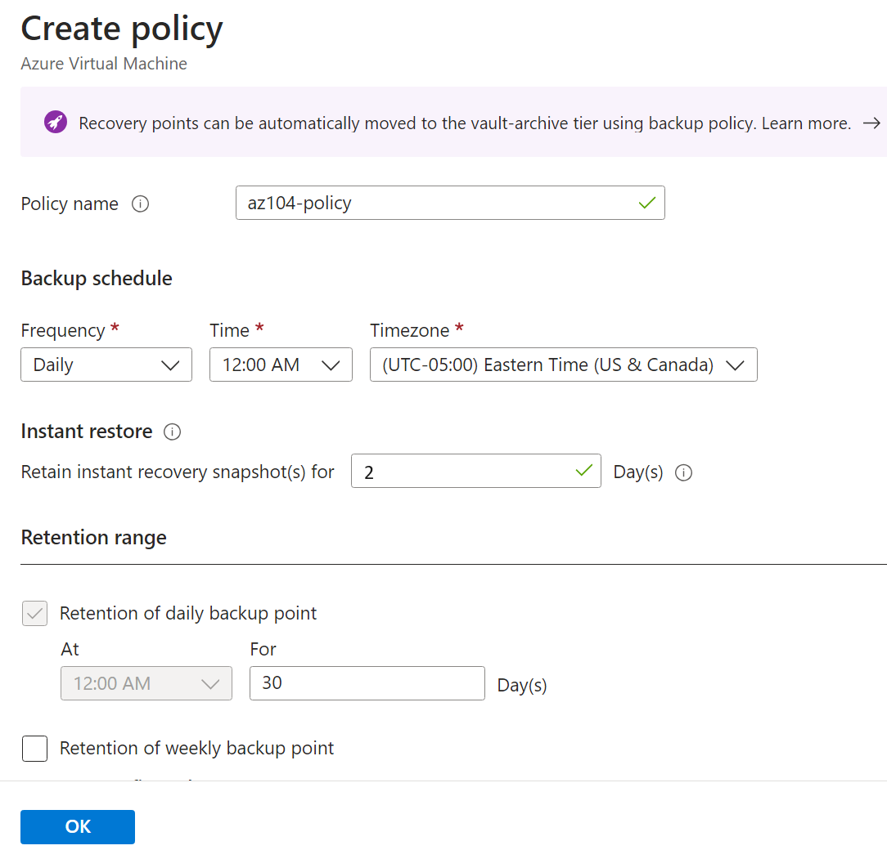

---
lab:
  title: "Laboratório\_10: Implementar a Proteção de Dados"
  module: Administer Data Protection
---

# Laboratório 10 – Implementar a Proteção de Dados

## Introdução ao laboratório    

Neste laboratório, você aprenderá sobre backup e recuperação de máquinas virtuais do Azure. Você aprenderá a criar um cofre do Serviço de Recuperação e uma política de backup para máquinas virtuais do Azure. Saiba mais sobre a recuperação de desastre com o Azure Site Recovery. 

Este laboratório requer uma assinatura do Azure. Seu tipo de assinatura pode afetar a disponibilidade de recursos nesse laboratório. Você pode alterar as regiões, mas as etapas são escritas usando o **Leste dos EUA** e o **Oeste dos EUA**.

## Tempo estimado: 50 minutos

## Cenário do laboratório

Sua organização está avaliando como fazer backup e restaurar as máquinas virtuais do Azure contra perda de dados acidental ou mal-intencionada. Além disso, a organização deseja explorar o uso do Azure Site Recovery para cenários de recuperação de desastre. 

## Habilidades de trabalho

+ Tarefa 1: Usar um modelo para provisionar uma infraestrutura.
+ Tarefa 2: Criar e configurar um cofre dos Serviços de Recuperação.
+ Tarefa 3: Configurar o backup no nível da máquina virtual do Azure.
+ Tarefa 4: Monitorar o Backup do Azure.
+ Tarefa 5: Habilitar a replicação da máquina virtual. 

## Tempo estimado: 40 minutos

## Diagrama de arquitetura

## Tarefa 1: Usar um modelo para provisionar uma infraestrutura

Nesta tarefa, você usará um modelo para implantar uma máquina virtual. A máquina virtual será usada para testar diferentes cenários de backup.

1. Baixe os arquivos do laboratório **\\Allfiles\\Lab10\\**.

1. Entre no **portal do Azure** - `https://portal.azure.com`.

1. Pesquise e selecione `Deploy a custom template`.

1. Na página de implantação personalizada, selecione **Criar seu modelo no editor**.

1. Na página Editar modelo, selecione **Carregar arquivo**.

1. Localize e selecione o arquivo **\\Allfiles\\Lab10\\az104-10-vms-edge-template.json** e selecione **Abrir**.

   >**Observação:** Reserve um momento para examinar o modelo. Estamos implantando uma rede virtual e uma máquina virtual para que possamos demonstrar o backup e a recuperação. 

1. **Salve** suas alterações.

1. Selecione **Editar parâmetros** e, em seguida, **Carregar arquivo**.

1. Carregue e selecione o arquivo **\\Allfiles\\Lab10\\az104-10-vms-edge-parameters.json**.

1. **Salve** suas alterações.

1. Use as informações a seguir para preencher os campos de implantação customizados, deixando todos os outros campos com seus valores padrão:

    | Configuração       | Valor         | 
    | ---           | ---           |
    | Subscription  | Sua assinatura do Azure |
    | Resource group| `az104-rg-region1` (Se necessário, selecione **Criar novo**)
    | Region        | **Leste dos EUA**   |
    | Nome de Usuário      | **localadmin**   |
    | Senha      | Forneça uma senha complexa |

1. Selecione **Examinar + Criar** e **Criar**.

    >**Observação:** Aguarde a implantação do modelo e selecione **Ir para o recurso**. Você deve ter uma máquina virtual em uma rede virtual. 

## Tarefa 2: Criar e configurar um cofre dos Serviços de Recuperação

Nesta tarefa, você criará um cofre dos Serviços de Recuperação. Um cofre dos Serviços de Recuperação fornece armazenamento para os dados da máquina virtual. 

1. No portal do Azure, pesquise e selecione `Recovery Services vaults` e, na folha **Cofres dos Serviços de Recuperação**, clique em **+ Criar**.

1. Na folha **Criar cofre dos Serviços de Recuperação**, especifique as seguintes configurações:

    | Configurações | Valor |
    | --- | --- |
    | Assinatura | o nome da sua assinatura do Azure |
    | Grupo de recursos | `az104-rg-region1`  |
    | Nome do cofre | `az104-rsv-region1` |
    | Region | **Leste dos EUA** |

    >**Observação**: certifique-se de especificar a mesma região na qual você implantou máquinas virtuais na tarefa anterior.

    

1. Clique em **Examinar + Criar**, certifique-se de que a validação foi aprovada e clique em **Criar**.

    >**Observação**: aguarde até que a implantação seja concluída. A implantação deve levar alguns minutos. 

1. Quando a implantação for concluída, clique em **Ir para o recurso**.

1. Na seção **Configurações**, clique em **Propriedades**.

1. Selecione o link **Atualizar** no rótulo **Configuração de Backup**.

1. Na folha **Configuração de Backup**, examine as opções para **Tipo de replicação de armazenamento**. Deixe a configuração padrão de **Redundância geográfica** no local e feche a folha.

    >**Observação**: Esta configuração só poderá ser definida se não houver itens de backup existentes.
    
    >**Você sabia?** A opção Restauração Entre Regiões permite que você restaure dados em uma [região emparelhada do Azure](https://learn.microsoft.com/azure/backup/backup-create-recovery-services-vault#set-cross-region-restore) secundária. 

1. Selecione o link **Atualizar** no rótulo **Configurações de segurança > Configurações de exclusão reversível e segurança**.

1. Na folha **Configurações de segurança**, observe que **Exclusão temporária (para carga de trabalho em execução no Azure)** está **Habilitada**. Observe que o **período de retenção de exclusão temporária** é de **14** dias. 

>**Você sabia?** O Azure tem dois tipos de cofres: Cofres dos Serviços de Recuperação e cofres de Backup. A principal diferença são as fontes de dados das quais é possível fazer backup. Saiba mais sobre [as diferenças](https://learn.microsoft.com/answers/questions/405915/what-is-difference-between-recovery-services-vault).

## Tarefa 3: Configurar backup no nível da máquina virtual do Azure

Nesta tarefa, você implementará o backup no nível da máquina virtual do Azure. Como parte de um backup de VM, você precisará definir a política de backup e retenção que se aplica ao backup. Diferentes VMs podem ter diferentes políticas de backup e retenção atribuídas a elas.

   >**Observação**: Antes de iniciar esta tarefa, verifique se a implantação iniciada na primeira tarefa desse laboratório foi concluída com sucesso.

1. Na folha do cofre dos Serviços de Recuperação, clique em **Visão Geral** e, em seguida, clique em **+ Backup**.

1. Na folha **Meta de Backup**, especifique as seguintes configurações:

    | Configurações | Valor |
    | --- | --- |
    | Onde a carga de trabalho está sendo executada? | **Azure** (observe suas outras opções) |
    | Do que você deseja fazer backup? | **Máquina virtual** (observe as outras opções)|

1. Selecionar **Backup**.

1. Observe que há dois **Subtipos de política**: **Avançado** e **Standard**. Examine as opções e selecione **Standard**. 

1. Na **Política de backup**, selecione **Criar uma nova política**.

1. Defina uma nova política de backup com as seguintes configurações (deixe as outras com seus valores padrão):

    | Configuração | Valor |
    | ---- | ---- |
    | Nome da política | `az104-backup` |
    | Frequência | **Diariamente** |
    | Hora | **12h00** |
    | Fuso horário | o nome do fuso horário local |
    | Reter os instantâneos de recuperação instantânea por | **2** Dia(s) |

    

1. Clique em **OK** para criar a política e, em seguida, na seção **Máquinas Virtuais**, selecione **Adicionar** (role para baixo).

1. Na folha **Selecionar máquinas virtuais**, selecione **az-104-10-vm0**, clique em **OK** e, em seguida, na folha **Backup**, clique em **Habilitar backup**.

    >**Observação**: Aguarde até que o backup seja habilitado. Isso deve levar aproximadamente 2 minutos.

1. Após a implantação, selecione **Acessar recurso**.
   
1. Na seção **Itens protegidos**, clique em **Itens de backup** e, em seguida, clique na entrada **Máquina virtual do Azure**.

1. Selecione o link **Exibir detalhes** para **az104-10-vm0** e examine os valores das entradas **Pré-verificação de backup** e **Status do último backup**.

    >**Observação:** Observe que o backup está pendente.
    
1. Selecione **Fazer backup agora**, aceite o valor padrão na lista suspensa **Manter backup até** e clique em **OK**.

    >**Observação**: Não aguarde a conclusão do backup, mas prossiga para a próxima tarefa.

## Tarefa 4: Monitorar o Backup do Azure

Nesta tarefa, você implantará uma conta de armazenamento do Azure. Em seguida, você configurará o cofre para enviar os logs e as métricas para a conta de armazenamento. Este repositório pode ser usado com o Log Analytics ou outras soluções de monitoramento de terceiros.

1. No portal do Azure, pesquise e selecione `Storage accounts`.

1. Na página Contas de armazenamento, selecione **Criar**.

1. Use as informações a seguir para definir a conta de armazenamento e clique em **Revisar + criar**.

    | Configurações | Valor |
    | --- | --- | 
    | Subscription          | *Sua assinatura*    |
    | Grupo de recursos        | **az104-rg-region1**        |
    | Nome da conta de armazenamento  | Forneça um nome global exclusivo   |
    | Region                | **Leste dos EUA**   |

1. Selecione **Criar**.

    >**Observação**: aguarde até que a implantação seja concluída. Deve levar cerca de um minuto.

1. Pesquise e selecione o cofre dos Serviços de Recuperação.

1. Na folha **Monitoramento**, clique em **Configurações de diagnóstico** e clique em **Adicionar configuração de diagnóstico**.

1. Nomeie a configuração `Logs and Metrics to storage`.

1. Coloque uma marca de seleção ao lado das seguintes categorias de log e métrica:

    - **Dados de Relatórios de Backup do Azure**
    - **Dados do Trabalho de Backup do Azure de Complementos**
    - **Dados do Alerta de Backup do Azure de Complementos**
    - **Trabalhos do Azure Site Recovery**
    - **Eventos do Azure Site Recovery**

1. Nos detalhes do Destino, coloque uma marca de seleção ao lado de **Arquivar em uma conta de armazenamento**.

1. No campo suspenso Conta de armazenamento, selecione a conta de armazenamento que você implantou anteriormente nesta tarefa.

1. Selecione **Salvar**.

1. Retorne ao cofre dos Serviços de Recuperação, na folha **Monitoramento** selecione **Trabalhos de backup**.

1. Localize a operação de backup da máquina virtual **az104-10-vm0**. 

1. **Visualize os detalhes** (role para a direita para ver o link) da tarefa de backup.

## Tarefa 5: Habilitar a replicação da máquina virtual

1. No portal do Azure, pesquise e selecione `Recovery Services vaults` e, na folha **Cofres dos Serviços de Recuperação**, clique em **+ Criar**.

1. Na folha **Criar cofre dos Serviços de Recuperação**, especifique as seguintes configurações:

    | Configurações | Valor |
    | --- | --- |
    | Assinatura | o nome da sua assinatura do Azure |
    | Grupo de recursos | `az104-rg-region2` (Se necessário, selecione **Criar novo**) |
    | Nome do cofre | `az104-rsv-region2` |
    | Região | **Oeste dos EUA** |

    >**Observação**: Certifique-se de especificar uma região **diferente** da máquina virtual.

1. Clique em **Examinar + Criar**, certifique-se de que a validação foi aprovada e clique em **Criar**.

    >**Observação**: aguarde até que a implantação seja concluída. A implantação deve levar alguns minutos. 

1. Pesquise e selecione a máquina virtual `az104-10-vm0`.

1. Na folha **Backup + Recuperação de desastre**, selecione **Recuperação de desastre**. 

1. Na guia **Noções básicas**, observe a **Região de destino**.

1. Selecione **Avançar: Configurações avançadas**. Seleções de recursos foram feitas para você. 

1. Role para baixo e **Crie** a conta de automação. 

   >**Observação:** É importante que as configurações sejam preenchidas ou a validação falhará. 

1. Selecione **Examinar + Iniciar replicação** e, em seguida, **Habilitar replicação**.

    >**Observação**: Habilitar a replicação levará de 10 a 15 minutos. Assista às mensagens de notificação no canto superior direito do portal. Enquanto aguarda, considere examinar os links de treinamento individualizado no final desta página.
    
1. Depois que a replicação for concluída, pesquise e localize o Cofre dos Serviços de Recuperação, **az104-rsv-region2**. Talvez seja necessário **Atualizar** a página. 

1. Na seção **Itens protegidos**, selecione **Itens replicados**.

1. Verifique se a máquina virtual está sendo exibida como íntegra para a integridade da replicação. Observe que o status mostrará o status da sincronização (começando em 0%) e, por fim, mostrará **Protegido** após a conclusão da sincronização inicial.

   

1. Selecione a máquina virtual para exibir mais detalhes.
   
>**Você sabia?** É uma boa prática [testar o failover de uma VM protegida](https://learn.microsoft.com/azure/site-recovery/tutorial-dr-drill-azure#run-a-test-failover-for-a-single-vm).

## Limpar os recursos

Se você estiver trabalhando com **sua própria assinatura**, reserve um minuto para excluir os recursos do laboratório. Isso garantirá que os recursos sejam liberados e que o custo seja minimizado. A maneira mais fácil de excluir os recursos do laboratório é excluir o grupo de recursos do laboratório. 

+ No portal do Azure, selecione o grupo de recursos, selecione **Excluir o grupo de recursos**, **Inserir o nome do grupo de recursos** e clique em **Excluir**.
+ Usar o Azure PowerShell, `Remove-AzResourceGroup -Name resourceGroupName`.
+ Usar a CLI, `az group delete --name resourceGroupName`.

## Estender seu aprendizado com o Copilot
O Copilot pode ajudar você a aprender a usar as ferramentas de script do Azure. O Copilot também pode ajudar em áreas não cobertas no laboratório ou onde você precisar de mais informações. Abra um navegador do Edge e escolha Copilot (canto superior direito) ou navegue até *copilot.microsoft.com*. Reserve alguns minutos para experimentar essas solicitações.

+ Quais produtos são suportados pelo Backup do Azure?
+ Resuma as etapas de backup e restauração de uma máquina virtual do Azure com o Backup do Azure.
+ Como posso usar o Azure PowerShell ou a CLI para verificar o status de um trabalho de Backup do Azure.
+ Forneça pelo menos cinco melhores práticas para configurar backups de máquina virtual do Azure.  

## Saiba mais com treinamento individual

+ [Proteja suas máquinas virtuais usando o Azure Backup](https://learn.microsoft.com/training/modules/protect-virtual-machines-with-azure-backup/). Use o Backup do Azure para ajudar a proteger servidores locais, máquinas virtuais, SQL Server, compartilhamentos de arquivos do Azure e outras cargas de trabalho.
+ [Proteja sua infraestrutura do Azure com o Azure Site Recovery](https://learn.microsoft.com/en-us/training/modules/protect-infrastructure-with-site-recovery/). Forneça a recuperação de desastre para sua infraestrutura do Azure personalizando a replicação, o failover e o failback de máquinas virtuais do Azure com o Azure Site Recovery.

## Principais aspectos a serem lembrados

Parabéns por concluir o laboratório. Aqui estão as principais lições desse laboratório. 

+ O serviço de Backup do Azure fornece soluções simples, seguras e econômicas para fazer backup e recuperar os seus dados.
+ O Backup do Azure pode proteger recursos locais e na nuvem, incluindo máquinas virtuais e compartilhamentos de arquivos.
+ As políticas de Backup do Azure configuram a frequência dos backups e o período de retenção dos pontos de recuperação. 
+ O Azure Site Recovery é uma solução de recuperação de desastre que fornece proteção para suas máquinas virtuais e aplicativos.
+ O Azure Site Recovery replica suas cargas de trabalho para um site secundário e, no caso de uma interrupção ou desastre, você poderá fazer failover para o site secundário e retomar as operações com tempo de inatividade mínimo.
+ Um cofre dos Serviços de Recuperação armazena seus dados de backup e minimiza a sobrecarga de gerenciamento.
